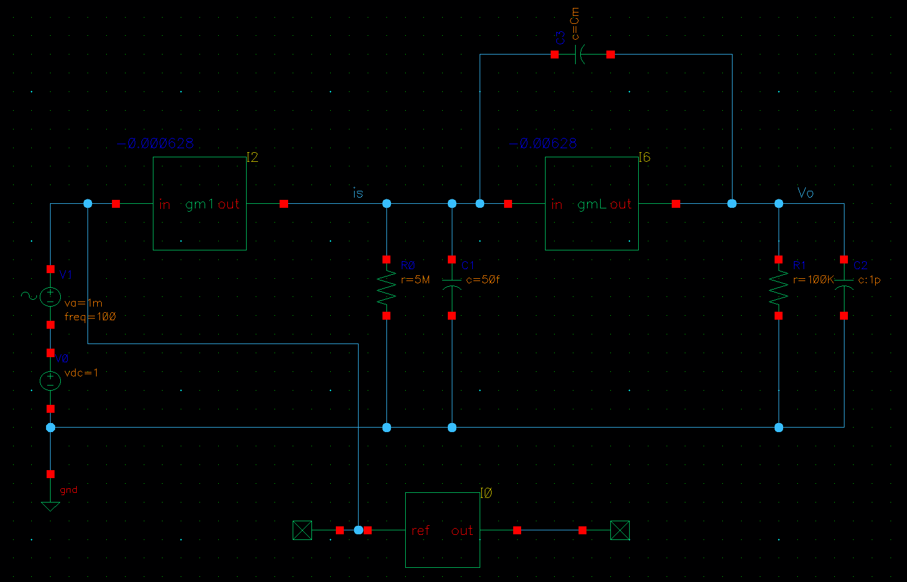
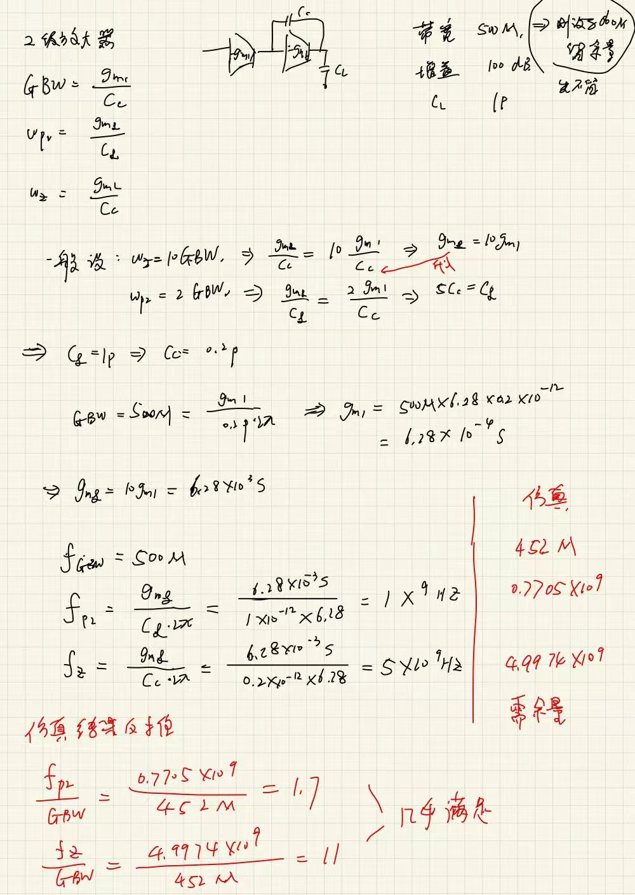
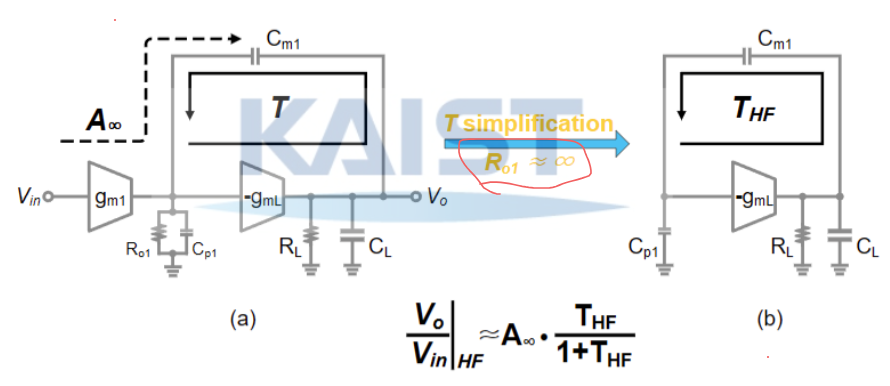
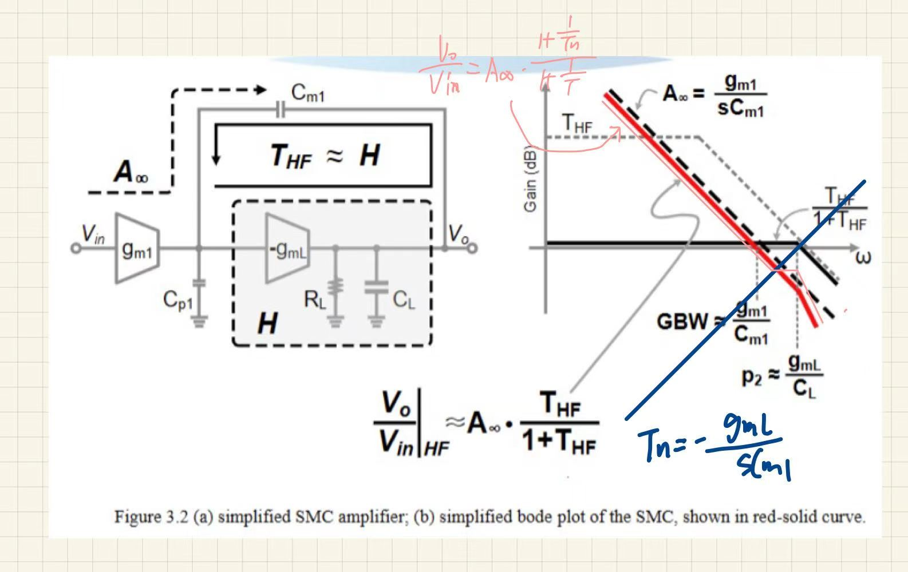
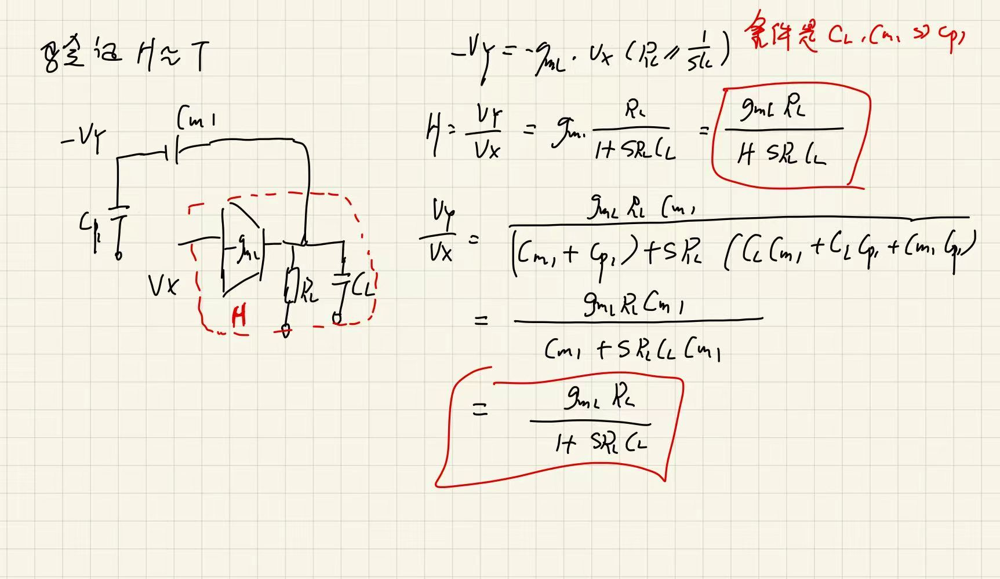
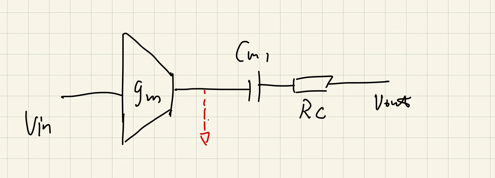
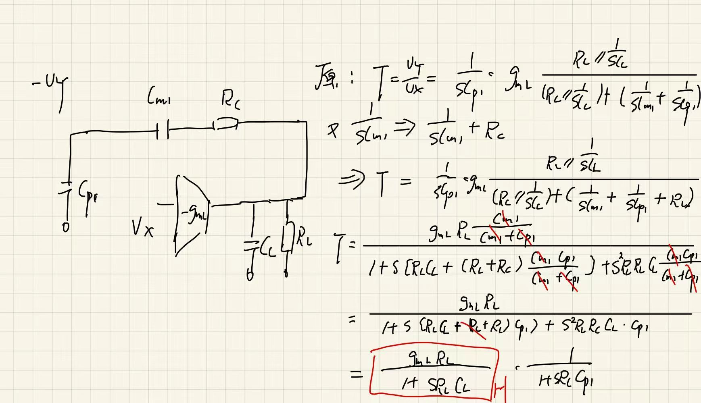
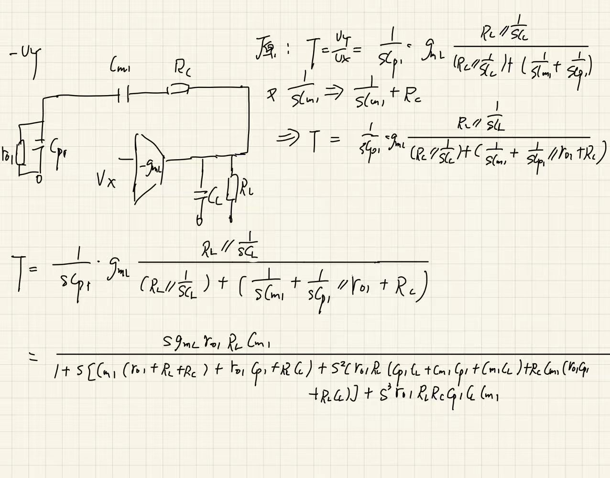
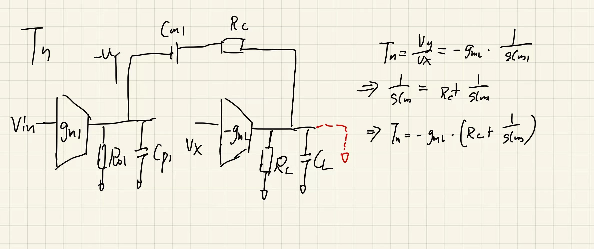
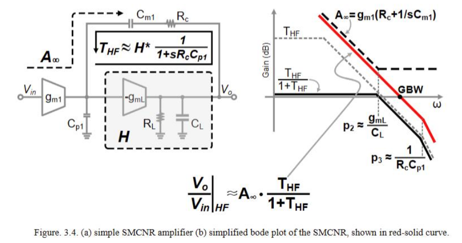

## chapter2

### 2.0

一个简单的放大器 $A$  和反馈因子 $F$  

这个公式是开环的：

$$
A \approx (R_{o1} \parallel \frac{1}{s C_{p1}}) \cdot g_{m} \cdot (R_{o2} \parallel \frac{1}{s C_{p2}})-----(2-1)
$$

$$
F \approx SC_{m} -----(2-2)
$$

两个独立的极点 $\frac{1}{R_{o1}C_{p1}}$  和   $\frac{1}{R_{o2}C_{p2}}$  。
放大器是一个电压并联反馈放大器(shunt-shunt)，由简单的放大器A和反馈因子F组成，使用反馈定理表示从 $i_{s}$  到  $v_{0}$  的增益为：

$$
\begin{gather}
\frac{i_{s}}{v_{o}} \approx \frac{A}{1 + AF} & \approx \frac{1}{F} &&& when \;AF \gg 1 ----(2-3-1)  \\
\ \ \ \ \ \ \ \ \ \ \ \ \ \ \ \ \ \ \  & \approx A &&& when \;AF \ll 1 ----(2-3-2)
\end{gather}
$$

当 $C_{m}$  极度小，在米勒补偿前， $C_{m} \approx 0$  这时   $F \approx SC_{m}$  变得无穷小。导致了2-3-2的条件  $AF \ll 1$  ，所以极点和放大器A相同。

  $C_{m}$  足够小的时候，如下图，A的传递函数小于  $\frac{1}{F}$  ，极点就是A的开环极点 $p_{1}, p_{2}$  

随着  $C_{m}$  逐步增加，AF也逐步增加，当  $C_{m}$  足够大的时候，$A F \gg 1$  的时候增益变为   $\frac{1}{F}$  。下图就是描述上述过程的。

极点的变化过程：
1. 低频段，式(2-1)化简为：

$$
A(s) = \frac{g_{m} R_{o1} R_{o2} }{(1 + s R_{o1} C_{p1}) (1 + s R_{o2} C_{p2})}
$$

两个独立的极点 $\frac{1}{R_{o1}C_{p1}}$  和   $\frac{1}{R_{o2}C_{p2}}$  ，直流增益为  $A_{0} = g_{m} R_{o1} R_{o2}$ 
图中蓝色虚线的模  $\left| \frac{1}{F} \right| = \frac{1}{(\omega C_{m})}$  
交点的条件： $\left| A F \right| = 1$  也就是两个曲线相等。

求解： 当   $C_{m}$  在增大时两个曲线出现交点，几点发生变化

$p_{1} \to p_{1}'$   令：

$$
A_{0} = g_{m} R_{o1} R_{o2} =  \left| \frac{1}{F} \right| = \frac{1}{(\omega C_{m})}
$$

解得：

$$
p_{1}' = \frac{1}{ g_{m} R_{o1} R_{o2} C_{m}}
$$

$p_{2} \to p_{2}'$   令

$$
\begin{gather}
\left| A(s) \right| = \frac{g_{m} R_{o1} R_{o2} }{(1 + s R_{o1} C_{p1}) (1 + s R_{o2} C_{p2})} \approx \frac{g_{m} R_{o1} R_{o2}}{\omega^{2} R_{o1} C_{p1} R_{o2} C_{p2}} = \frac{g_{m}}{\omega^{2} C_{p1} C_{p2}}\\
\left| A(s) \right| = \left| \frac{1}{F} \right| = \frac{1}{(\omega C_{m})}
\end{gather}
$$

解得：

$$
p_{2}' = \frac{g_{m} C_{m}}{C_{p1} C_{p2}}
$$

==**存在一个漂亮的不变量：**==

$$
p_{1}' \cdot p_{2}' =  \frac{1}{ g_{m} R_{o1} R_{o2} C_{m}} \cdot \frac{g_{m} C_{m}}{C_{p1} C_{p2}} = \frac{1}{R_{o1}C_{p1}} \cdot \frac{1}{R_{o2}C_{p2}} = p_{1} \cdot p_{2}
$$

### 2.1应用负反馈的方法去密勒补偿[[EET的使用.md#^969895]]
没有其他提示的话：下面假设  $g_{mi} \gg 1; C_{mi},C_{L} \gg C_{pi}$  

上图可以变为：模块H和反馈元件 $C_{m1}$  ，传递函数根据闭环增益等式表示为：

$$
\frac{V_{0}(s)}{V_{in}(s)} \approx A_{\infty} \cdot \frac{T}{1 + T} + \frac{d}{1 + T} \approx A_{\infty} \cdot \frac{T}{1 + T} ----(2-4)
$$

T：密勒环路增益； 当 $T = \infty$ 时 $A_{\infty}$  是理想的闭环增益；d是 $T = 0$ 时的直接前馈
前一项反映了极点的影响，后一项的d反映了前馈的零点影响，极点准单数零点不准。
[^1]

#### ==第一步先求解  $A_{\infty}$==  

如图所示：可得

$$
\begin{gather}
g_{m1}(V_{in} - 0) = (0 - V_{0}) S C_{m1} \\[10pt]
A_{\infty} = \frac{V_{0}}{V_{in}} = -\frac{g_{m1}}{S C_{m1}} ----(2-5)
\end{gather}
$$

^2-5

### ==**第二步：求T：密勒环路增益**==  
>[!method] 
>也就是求极点的办法，输入接地然后断开环路，给测试信号 $V_{x}$ 然后给另一端 $-V_{y}$ 得到 $T = \frac{V_{y}}{V_{x}}$ 
>[[EET的使用.md#^f096ef]]

>[!question] 
>这里的电流方向问题： $V_{x} \cdot (-g_{m})$  方向是向外流，然后就是电阻电容的分压问题了。   

$$
\begin{gather}
V_{x} (- g_{mL}) \frac{(R_{L} \parallel \frac{1}{s C_{L}}) \cdot R_{o1} \parallel \frac{1}{s C_{p1}}} {(R_{L} \parallel \frac{1}{s C_{L}}) + (\frac{1}{s C_{m1}} + R_{o1} \parallel \frac{1}{s C_{p1}})} = -V_{y}  \\[12pt]
\frac{V_y}{V_x}=\frac{g_{mL}R_{o1}R_L\,sC_{m1}}
{1+s\left[R_{o1}\left(C_{p1}+C_{m1}\right)+R_L\left(C_L+C_{m1}\right)\right]
+s^{2}R_{o1}R_L\left(C_{p1}C_L+C_{p1}C_{m1}+C_LC_{m1}\right)}
\end{gather}
$$

化简：条件  $C_{L} \gg C_{m1} \gg C_{p1}$ ^61c425

$$
\frac{V_y}{V_x}=\frac{g_{mL}R_{o1}R_L\,sC_{m1}}
{1+s\left[R_{o1}\left(C_{p1}+C_{m1}\right)+R_L\left(C_L+C_{m1}\right)\right]
+s^{2}R_{o1}R_{L} C_{L} C_{m1}}----(2-6-1)
$$

再次化简：条件 $C_{L} \gg C_{m1} \gg C_{p1}$  可以去掉  $R_{o1} C_{p1}$  和  $R_{L} C_{m1}$  

$$
T = \frac{V_y}{V_x}=\frac{g_{mL}R_{o1}R_L\,sC_{m1}} {1+s (R_{o1} C_{m1}+R_{L} C_{L}) + s^{2}R_{o1}R_{L} C_{L} C_{m1}} = \frac{g_{mL}R_{o1}R_L\,sC_{m1}} {(1+s R_{o1} C_{m1}) (1 + s R_{L} C_{L})}----(2-6-2)
$$

上式很清楚的看出系统的两个极点。
当频率 $\omega \gg \frac{1}{R_{o} C_{m1}}$  时，$1 + s R_{o1}C_{m1} \to s R_{o1}C_{m1}$  ，分子分母约掉后：

$$
T = \frac{g_{mL}R_L} {1 + s R_{L} C_{L}} \xrightarrow{\omega \gg \frac{1}{R_{L} C_{L}}} \frac{g_{mL}}{s C_{L}}----(2-6-3)

$$

^2-6-3

故：

$$
\frac{T}{1 + T} = \frac{g_{mL}R_{L}}{1 + g_{mL}R_{L} + s R_{L} C_{L}} \approx \frac{1}{1 + s \frac{C_{L}}{g_{mL}}}----(2-6-4)
$$

^2-6-4

> [!note] 结果说明 
> 这个结果和简化电路图的结果是一样的 $\frac{T}{1 + T} = \frac{1}{1 + \frac{1}{T}}$
> 如下链接，直接计算出(2-6-4)的结果：
>[[EET的使用.md#^f096ef]]
>这里就是计算出了高频的等效极点的位置。

### ==**第三步求 $T_{n}$ ：密勒环路增益**==

>[!method] 
>求零点的办法，也就是求 $T_{n}$ 的办法，输入信号存在，看什么条件下输出信号可以虚地。

如图：可得

$$
-g_{mL} V_{x} = (0 - (-V_{y})) sC_{m1}
$$

可得零点公式：

$$
T_{n} = \frac{V_{y}}{V_{x}} = - \frac{g_{mL}}{sC_{m1}} ----(2-7)
$$

^2-7

将公式(2-5)，(2-6,)，(2-7) 带入完整的公式：

$$
\begin{gather}
H(s) = A_{\infty} \frac{1 + \frac{1}{T_{n}}}{1 + \frac{1}{T}} = -\frac{g_{m1}}{sC_{m1}} \cdot \frac{1 - \frac{1}{\frac{g_{mL}}{sC_{m1}}}}{1 + \frac{1}{\frac{g_{mL}}{s C_{L}}}} = - \underbrace{\frac{g_{m1}}{sC_{m1}}}_{\text{GBW}} \cdot \frac{1 - \frac{sC_{m1}}{g_{mL}}}{1 + \frac{s C_{L}}{g_{mL}}} ----(2-8)
\end{gather}
$$

### ==**第四步：完整的公式**==
没化简的结果：

$$
\begin{gather}
T = \frac{g_{mL}R_{o1}R_L\,sC_{m1}}
{1+s\left[R_{o1}\left(C_{p1}+C_{m1}\right)+R_L\left(C_L+C_{m1}\right)\right]
+s^{2}R_{o1}R_L\left(C_{p1}C_L+C_{p1}C_{m1}+C_LC_{m1}\right)} \\[4pt]
T_n = -\frac{g_{mL}}{sC_{m1}} \\[4pt]
A_{\infty} = -\frac{g_{m1}}{s C_{m1}}
\end{gather}
$$

带入公式： 这个是完整的公式(没化简过的)

$$
\begin{align}
A(s) &= -\frac{g_{m1}}{s C_{m1}} \frac{1 - \frac{sC_{m1}}{g_{mL}}}{1 + \frac
{1+s[R_{o1}(C_{p1}+C_{m1})+R_L(C_L+C_{m1})]
+s^{2}R_{o1}R_L(C_{p1}C_L+C_{p1}C_{m1}+C_LC_{m1})}{g_{mL}R_{o1}R_L\,sC_{m1}}}\\[4pt]
&=-\frac{g_{m1}g_{mL}R_{o1}R_L(1 - \frac{sC_{m1}}{g_{mL}})}{
1+ sg_{mL}R_{o1}R_L\,C_{m1} + s[R_{o1}(C_{p1}+C_{m1})+R_L(C_L+C_{m1})]
+s^{2}R_{o1}R_L(C_{p1}C_L+C_{p1}C_{m1}+C_LC_{m1})}
\end{align}
$$

>[!summary] 
>上式表示了电路的高频等效极点和零点：$H(s) = A_{\infty} \frac{1 + \frac{1}{T_{n}}}{1 + \frac{1}{T}}$
> 单位增益带宽： $GBW = \frac{g_{m1}}{C_{m1}}$
> 高频等效极点： $p = \frac{g_{mL}}{C_L}$
> 高频等效零点： $z = -\frac{g_{mL}}{sC_{m1}}$

#### ==注：==

$$
A = A_\infty \cdot \frac{T}{1+T}
$$

$$
A_\infty = \frac{V_o}{V_{in}} = -\frac{g_{m1}}{sC_{m1}}
$$

$$
T = \frac{V_y}{V_x}
= \frac{g_{mL}R_{o1}R_L\,sC_{m1}}{1+s\left(R_{o1}C_{m1}+R_LC_L\right)+s^{2}R_{o1}R_LC_LC_{m1}}
= \frac{g_{mL}R_{o1}R_L\,sC_{m1}}{\left(1+sR_{o1}C_{m1}\right)\left(1+sR_LC_L\right)}
$$

2. 代入化简

记 $N=g_{mL}R_{o1}R_L\,sC_{m1}$，$D=(1+sR_{o1}C_{m1})(1+sR_LC_L)$，则

$$
D+N = 1+s\left[R_{o1}C_{m1}+R_LC_L+\underbrace{g_{mL}R_{o1}R_LC_{m1}}_{\text{Miller feedback}}\right]+s^{2}R_{o1}R_{L} C_{L}C_{m1}
$$

$$
\frac{T}{1+T}=\frac{N}{D+N}=\frac{g_{mL}R_{o1}R_L\,sC_{m1}}{D+N}
$$

**关键一步**：$A_\infty$ 分母上的 $sC_{m1}$ 与此处分子上的 $sC_{m1}$ 正好约掉。

3. 结果

$$
\boxed{\;A(s)=\frac{-\,g_{m1}g_{mL}R_{o1}R_L}{1+s\left[g_{mL}R_{o1}R_LC_{m1}+R_{o1}C_{m1}+R_LC_L\right]+s^{2}R_{o1}R_LC_LC_{m1}}\;}
$$

$s\to 0$ 时 $A\to -g_{m1}g_{mL}R_{o1}R_L=-A_{v0}$ ，正是两级放大器的直流增益。积分器形式的 $A_\infty$  被 $T/(1+T)$ 的原点零点抵消掉了——这也是 DOA 要先把 $T$ 的原点零点与 $1/R_{o1}C_{m1}$ 极点对消看清楚的原因。

4. 新极点位置

$b_1'=g_{mL}R_{o1}R_LC_{m1}+R_{o1}C_{m1}+R_LC_L$，$b_2=R_{o1}R_LC_LC_{m1}$。

由于 $g_{mL}R_L\gg 1$，$b_1'$ 被 Miller 项主导：

$$
p_1'\approx-\frac{1}{b_1'}\approx-\frac{1}{g_{mL}R_{o1}R_LC_{m1}}
$$

$$
p_2'\approx-\frac{b_1'}{b_2}\approx-\frac{g_{mL}R_{o1}R_LC_{m1}}{R_{o1}R_LC_LC_{m1}}=-\frac{g_{mL}}{C_L}
$$

即

$$
A(s)\approx\frac{-A_{v0}}{\left(1+s\,g_{mL}R_{o1}R_LC_{m1}\right)\left(1+s\,C_L/g_{mL}\right)}
$$

> [!note] 精度说明
> 这两个时间常数的**乘积**严格等于 $b_2$，只有它们的**和**是近似的（丢掉了 $R_{o1}C_{m1}+R_LC_L$）。

5. 与开环极点对照

| | 开环 $T$ | 闭环 $A$ | 移动倍数 |
| --- | --- | --- | --- |
| 主极点 | $\dfrac{1}{R_{o1}C_{m1}}$ | $\dfrac{1}{g_{mL}R_LR_{o1}C_{m1}}$ | 下移 $g_{mL}R_L$ |
| 次极点 | $\dfrac{1}{R_LC_L}$ | $\dfrac{g_{mL}}{C_L}$ | 上移 $g_{mL}R_L$ |

同一个因子、方向相反，乘积 $=1/b_2$ 不变——这就是极点分裂，也是 $p_1'p_2'=p_1p_2$ 的完整闭环版本。

6. 自洽检验

$$
\mathrm{GBW}=A_{v0}\cdot\left|p_1'\right|=\frac{g_{m1}g_{mL}R_{o1}R_L}{g_{mL}R_{o1}R_LC_{m1}}=\frac{g_{m1}}{C_{m1}}
$$

相位裕度由下式决定：

$$
\frac{\left|p_2'\right|}{\mathrm{GBW}}=\frac{g_{mL}C_{m1}}{g_{m1}C_L}
$$

7. 需要留意：RHP 零点去哪了

> [!warning] 这个结果里没有 $z=+g_{mL}/C_{m1}$
> 渐近增益模型的完整形式是 $A=A_\infty\dfrac{T}{1+T}+A_0\dfrac{1}{1+T}$。第二项（把受控源 $g_{mL}$ 置零后经 $C_{m1}$ 的直通路径）被省略了，而 RHP 零点恰恰藏在 $A_0$ 里。
> 分析极点分裂与相位裕度的主体部分用上式没问题；但讨论 **SMCNR（调零电阻）** 时必须把 $A_0$ 项补回来——那正是调零电阻要对付的东西。

### **==第五步：建模仿真==**
cadence 中仿真：
原理图：

计算结果与仿真结果对比：

>[!analy] 分析
>1.GBW没达到500M，下次需要给出余量要100M左右。
>2.第二极点频率没达到2倍，主要是公式 [[#^61c425]]  并不是完全满足，这个条件。
>3.零点几乎完全满足条件了。

## chapter3 Design Example According to DOA

>[!assumming] 假设
>1. $g_{mi} r_{o1} \gg 1$  and  $C_{mi},C_{L} \gg C_{pi}$  $GBW \gg \frac{1}{R_{o1} C_{m1}}$ (or  $GBW \gg \frac{1}{R_{o1} C_{p1}}$ for SMCCB ) 

### 3.1 Simple Miller Compensation (SMC)

这里的内容在上一章都算过了，其中有些新的东西：

新加了一个频率曲线给出了： 
	1. $A_{\infty}$  的频率曲线 公式[[#^2-5]] 
	2.  $\frac{1}{1+\frac{1}{T}}$ 的曲线，[[#^2-6-4]]
	3.  $T$ 的曲线  [[#^2-6-3]]
	4. 给出了高频的极点
	5. 添加一个 $T_n$  的频率响应(如图的曲线) [[#^2-7]]

验证了： $T \approx H$  

相位裕度：第一个极点的相移是90°，然后就是T引入的p2的相移：

$$
PM' = 90^{\circ} - \tan^{-1}{\frac{GBW}{p_2}}
$$
再次引入零点的相移：(文中给出的办法是独立评估零点，好像不可取)

$$
PM = 90^{\circ} - \tan^{-1}{\frac{GBW}{p_2}} - \tan^{-1}{\frac{g_{m1}}{g_{mL}}}
$$

当 $g_{mL} \gg g_{m1}$ 的时候零点是可以忽略的

### 3.2 Simple Miller Compensation with Nulling Resistor  (SSMCNR)

第一步： $A_{\infty}$  

$$
\frac{V_{out}-0}{R_{C} + \frac{1}{sC_{m1}}} = g_{m1} V_{in} \Rightarrow A_{\infty} = \frac{V_{out}}{V_{in}} = g_{m1}(R_{C} + \frac{1}{sC_{m1}})
$$
第二步：T 

求得T未化简：**==这里忘了ro1了明天加上==**

$$
T = \frac{g_{mL}R_{L} \frac{C_{m1}}{C_{m1} + C_{p1}}}{1 + s[R_L C_L + (R_L + R_C)\frac{C_{m1}C_{p1}}{C_{m1} + C_{p1}}]  + s^2R_L R_C C_L \frac{C_{m1}C_{p1}}{C_{m1} + C_{p1}}} 
$$

又 $C_{m1} \gg C_{p1}$  化简得:

$$
T = \frac{g_{mL}R_L}{1 + sR_L C_L} \cdot \frac{1}{1+sR_LC_{p1}} 
$$

当评率较高的时候 $sR_L C_L \gg 1$  化简:

$$
T = \frac{g_{mL}}{C_L} \cdot \frac{1}{1 + sR_LC_{p1}}  \Rightarrow H \cdot \frac{1}{1 + sR_LC_{p1}}----(3-7)
$$
第三个极点就是：

$$
p_3 \approx \frac{1}{R_C C_{p1}}----(3-8)
$$

这个是完整的T的公式：引入ro1

$$
T(s) = \frac{s g_{mL} r_{o1} R_L C_{m1}}{1 + s[C_{m1}(r_{o1} + R_LC_L) + r_{o1} C_{p1} + R_L + C_L] + s^2[r_{o1}R_L(C_{p1} C_L + C_{m1}C_{p1} + C_{m1}C_L) + R_C C_{m1}(r_{o1}C_{p1} + R_LC_L)] + s^3r_{o1}R_L R_C C_{p1}C_L C_{m1}}
$$

第三步 $T_n$ ：

$$
T_n = -g_{mL} \cdot (R_C + \frac{1}{sC_{m1}})
$$

第四步带入公式：

$$
H(s) = A_{\infty} \cdot \frac{1+\frac{1}{T_n}}{1 + \frac{1}{T}} = g_{m1}(R_{C} + \frac{1}{sC_{m1}}) \cdot \frac{1 + \frac{1}{-g_{mL} \cdot (R_C + \frac{1}{sC_{m1}})}}{1 + \frac{1}{\frac{s g_{mL} r_{o1} R_L C_{m1}}{1 + s[C_{m1}(r_{o1} + R_L + R_C) + r_{o1} C_{p1} + R_L + C_L] + s^2[r_{o1}R_L(C_{p1} C_L + C_{m1}C_{p1} + C_{m1}C_L) + R_C C_{m1}(r_{o1}C_{p1} + R_LC_L)] + s^3r_{o1}R_L R_C C_{p1}C_L C_{m1}}}}
$$

化简结果：

$$ 
H(s)=g_{m1}g_{mL}r_{o1}R_L\cdot \frac{1-sC_{m1}\left(\dfrac{1}{g_{mL}}-R_C\right)} {1+a_1s+a_2s^{2}+a_3s^{3}} 
$$ $$
\begin{aligned} a_1&=C_{m1}\left(g_{mL}r_{o1}R_L+r_{o1}+R_L+R_C\right)+r_{o1}C_{p1}+R_LC_L\\[4pt] a_2&=r_{o1}R_L\left(C_{p1}C_L+C_{m1}C_{p1}+C_{m1}C_L\right)+R_CC_{m1}\left(r_{o1}C_{p1}+R_LC_L\right)\\[4pt] 
a_3&=r_{o1}R_LR_CC_{p1}C_LC_{m1} 
\end{aligned} 
$$
再次化简：

$$
H(s)=g_{m1}g_{mL}r_{o1}R_L\cdot \frac{1-sC_{m1}(\dfrac{1}{g_{mL}}-R_C)} {1+sC_{m1}g_{mL}r_{o1}R_L+s^{2}r_{o1}R_L(C_{p1}C_L+C_{m1}C_{p1}+C_{m1}C_L)+s^{3}r_{o1}R_LR_CC_{p1}C_LC_{m1}} 
$$

令高频极点和零点抵消：可以得到补偿电容的值

$$
\begin{gather}
p_2 \approx \frac{g_{mL}}{C_L} = \frac{1}{(R_C-1/g_{mL}) C_{m1}}  = z \\[4pt]
R_C = \frac{C_L + C_{m1}}{g_{mL}C_{m1}}----(3-10)
\end{gather}
$$

相位裕度：第一个极点相移90°，然后第二极点和零点抵消，只剩第三极点相移：

$$
PM = 90^ \circ - tan^{-1}(\frac{GBW}{1/R_CC_{p1}}) ----(3-11)
$$

可知相位裕度和第三极点相关，且第三极点的频率天然会很高。

#### 注：

[^1]: 注：这个公式在另一本书中表示为：
	
	$$
	\frac{V_{0}(s)}{V_{in}(s)} \approx A_{\infty} \cdot \frac{T}{1 + T} + A_{0} \frac{1}{1 + T} \approx A_{\infty} \cdot \frac{T}{1 + T}
	$$
	
	其中 $A_{0}$  为输入为0的时候的增益，当让输入为0的时候输出也为0，所以  $A_{0} = 0$  也就可以得到上面的公式了。  
