《Analysis of multistage amplifier-frequency compensation》这篇论文是很经典的一篇讲频率补偿的文献，里面综述了对二、三级运放补偿的多种结构，并进行了比较。但是文章直接给了传递函数的表达式，并没有解释其原理，这里我将用局部反馈的方法对这篇论文中提到的每一种结构进行详细的推导。

原文是在notion上写的，B站这里添加不了目录，比较麻烦，建议在下面的网址看，更方便：

https://candied-place-2bd.notion.site/Analysis-of-multistage-amplifier-frequency-compensation-bf67357eed4644ca94d7999df8fc180c

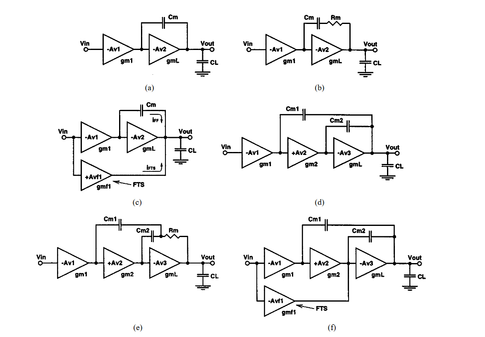

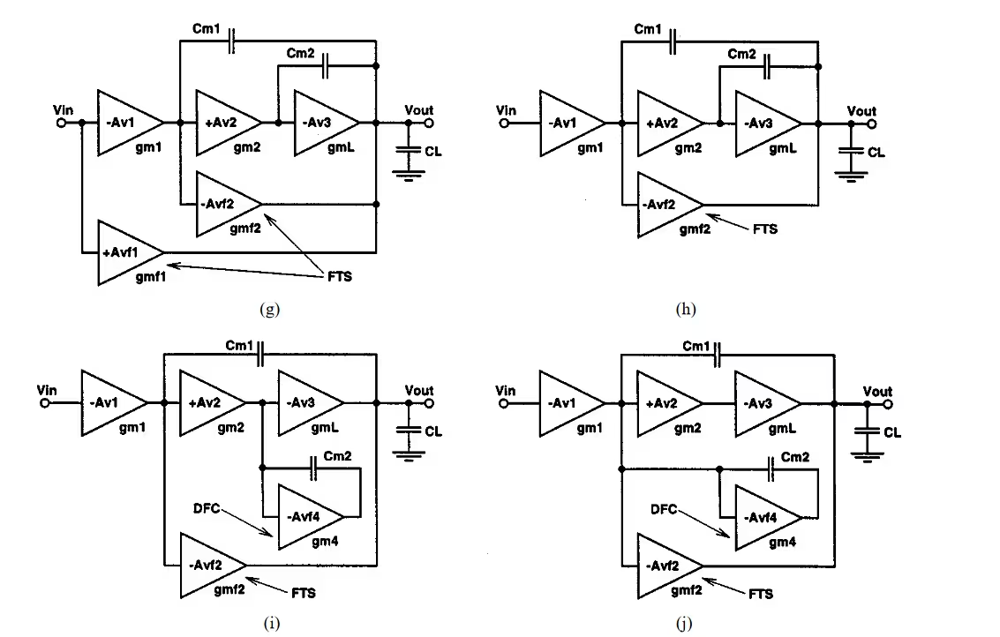

**SMC(Simple Miller Compensation)**

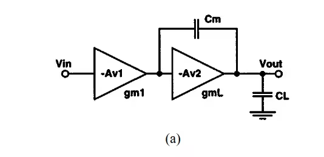

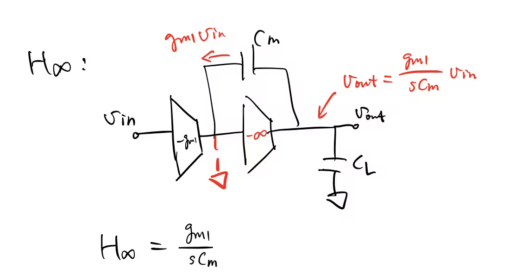

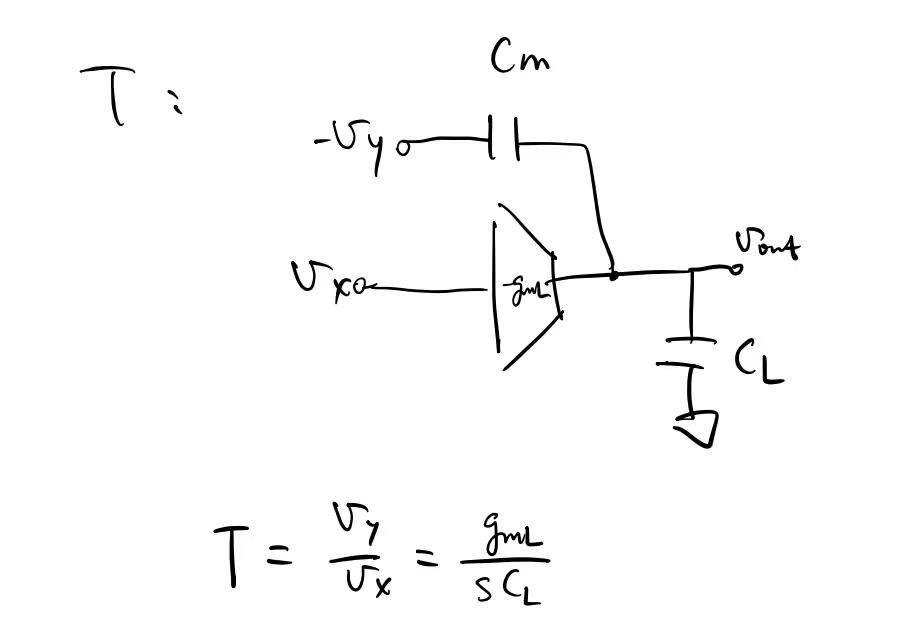

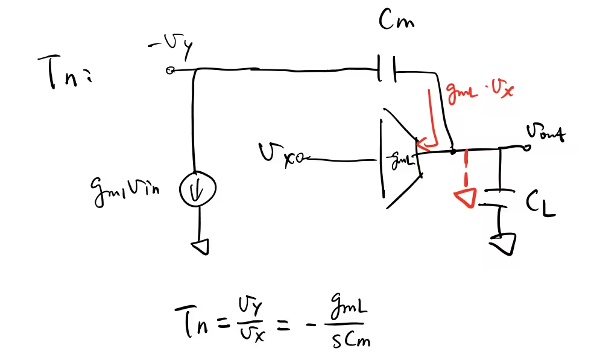

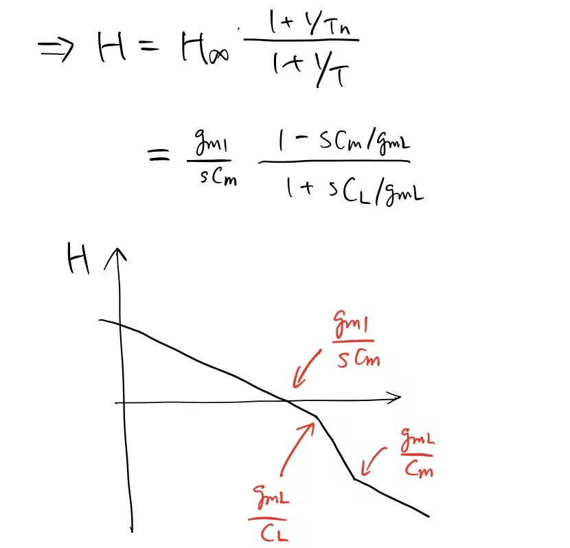

需要说明的是，这里仅考虑了高频时候的情况，低频下由于Cm的阻抗较大，环路增益T实际上是很小的，当ω小于T的第一个单位增益带宽时，环路失效，H不再是积分器-20dB的斜率，而是变平，由此产生了H的主极点。但是我们这里考虑的是高频，电阻跟电容并联，足以被忽略掉，所以看不到这里的主极点。
论文中说，这里的右零点会严重影响相位裕度。为了降低这个影响，将此零点gmL/Cm放到GBW=gm1/Cm更远处，也就意味着gm1/gmL越小越好。但是gm1不能太小了，假设vgs不变，gm太小就意味着ID很小，影响摆率，同时ID小也意味着尺寸小，管子尺寸的匹配性就差，失调电压更大。利用源极电阻衰减等效的gm1在低压场景也是不合适的，会限制共模输入范围。

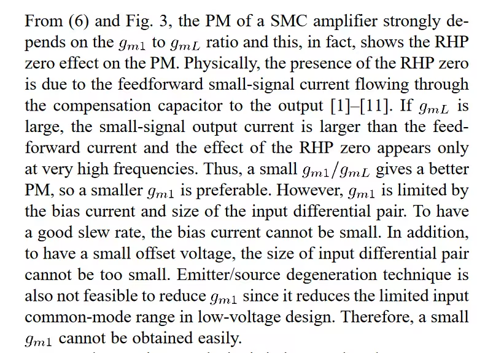

**SMCNR(Simple Miller Compensation with Nulling Resistor)**

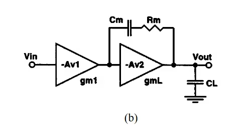

SMC补偿的缺点是有个右零点，会严重降低相位裕度。在上面计算SMC零点的时候，可以看到问题在于Cm。Vout虚地的时候，Cm两端看到的电阻是负的，所以会有右零点，那么补偿这个右零点最简单的方法就是串一个电阻进去，把这个负阻变成0或者正的电阻，或者依然是负阻但是绝对值小一些，也就是挪远一点。不论什么情况，这些都有利于相位裕度。如果刚好补在1/gmL处，那么就没有零点了，然而准确的补偿也不太好成立。
再来写表达式，显然添加进去的这个Rm主要影响零点，对极点的影响很小，因为输入置零的话，Rm上没有电流，两端等效阻抗无穷大。因为只改变零点，那么只需要在SMC的分子上，改掉Cm两端的等效电阻就可以了。

文献中还考虑了第一级输出电阻Ro1的影响，这样考虑极点的时候Cm和Rm上就有电流了，所以表达式长这个样子：

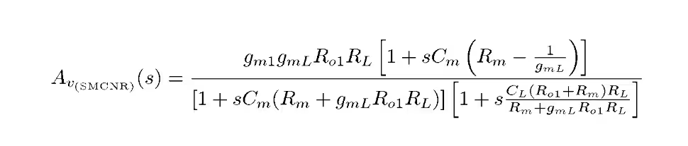

从表达式的结果看，Rm不能比Ro1同数量级，否则这个次级点就要降了，这...我觉得条件还是挺宽裕的......论文中说Rm要大于等于gmL，小于Ro1的十分之一。

除了加调零电阻外，文章还简单提到了一些利用Buffer的补偿办法，比如用电压buffer和电流buffer。从带宽的角度来看，电流buffer的效果要明显好于电压buffer。我是这么理解的，同样是阻挡了前馈通路，电流buffer还同时阻挡了Cp1和Cm的电压反馈，使分压消失，从而提升了局部反馈中环路增益的GBW。电压buffer阻挡了CL和Cp1串联Cm的电流反馈，使分流消失，但是Cm和Cp1串联分走的电流并不大，所以带宽提升的效果不明显，所以电流buffer的带宽要更大，关键在于它去掉了更大的无源反馈。

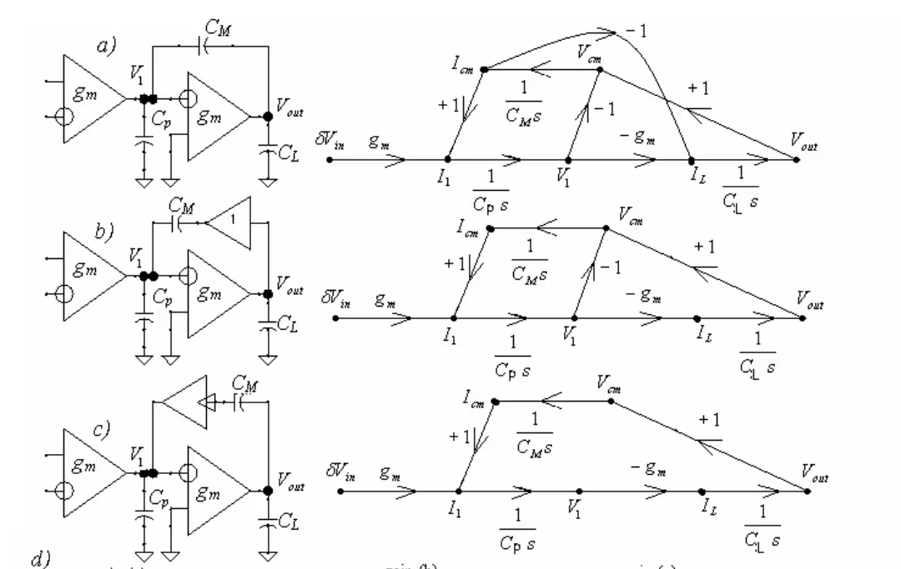

然而，Ivanov在他的书中提到，加buffer的好处是有限的，因为这个buffer的性能很难做到特别好，总会有个输入电阻或者输出电阻（如source follower或者common gate的1/gm电阻），从而导致了第三个极点的产生。这第三个极点也是环路增益的次级点，为保证稳定性，这个极点又需要远离环路增益的GBW，那势必需要更高的功耗——如此一来就很没有意思，因为直接去提升gmL也就是直接增加了功耗而已。

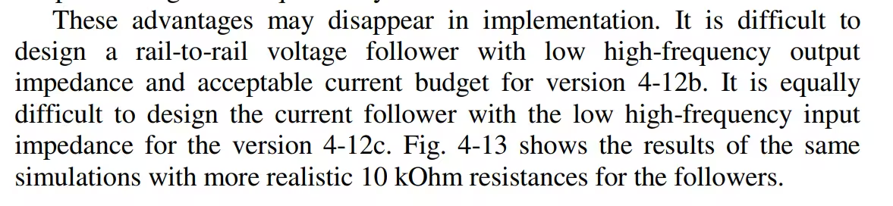

Ivanov Operational Amplifier Speed and Accuracy Improvement

如此看来，直接加入调零电阻真是简单又实用的一个好选择哇。

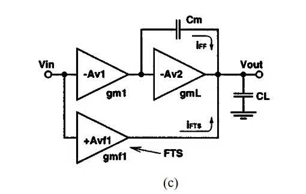

所谓Multipath，就是说有多个前向通路，它的想法是：零点不就是因为前向通路的电流吗，我给个大小相同方向相反的电流把它给补掉不就行了？
还是从局部反馈的观点来看，这里的理想增益H∞还有局部反馈的环路增益T仍然和SMC中的情况一样，关键是局部反馈的Tn不同，如果gmf=gm1，那这里的Tn就是0。

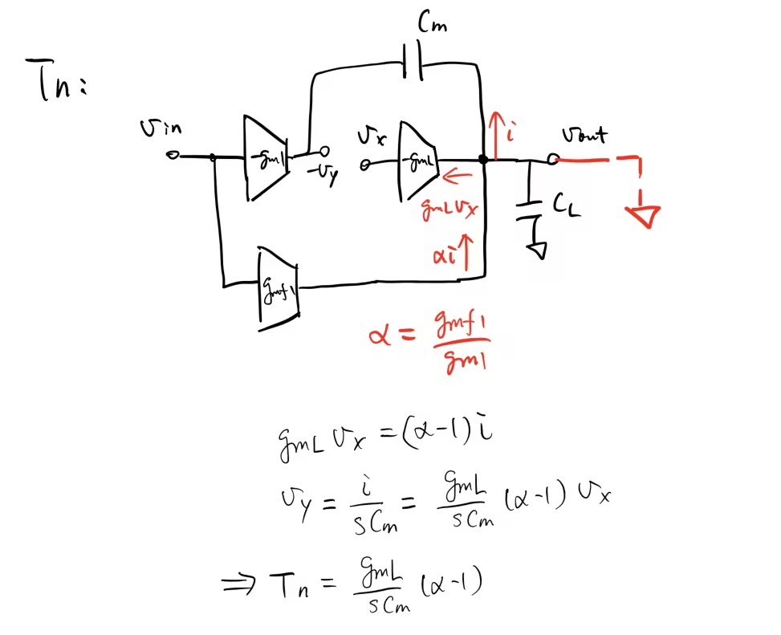

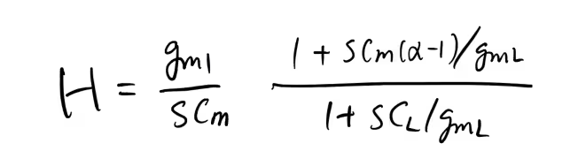

对比论文中的结果，是一致的。

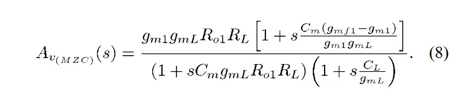

论文中还说，在某些场合，CL固定的话，gmf1可以取得更大（α更大）以产生左零点去抵消掉次级点gmL/CL（因为CL固定，次级点也是固定的），以得到更大的带宽或者相同带宽下有更小的面积。作者又提到在这种情况下Cm必须远大于Cp1，建议十倍以上，这样Cp1和Cm1分压为1的近似才成立。

# **NMC(Nested Miller Compensation)**

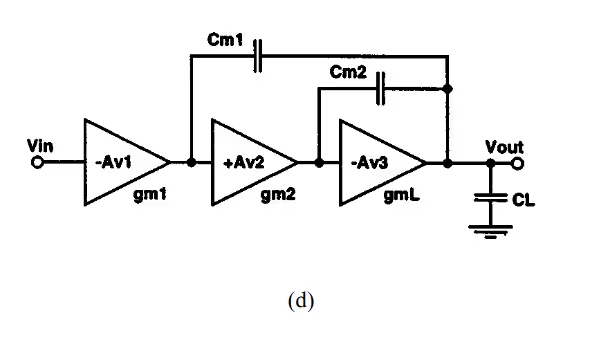

Nested中文译过来叫“嵌套”，NMC就是嵌套米勒补偿。

用局部反馈的观点来看，这里依次插入两个测试的源：

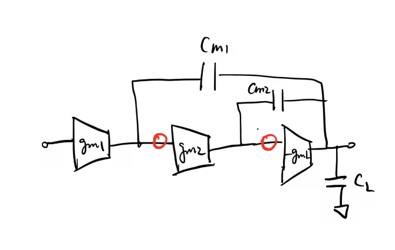

视gm2形成的环路为局部反馈，视gmL在gm2环路中的环路为局部反馈中的局部反馈。可以采用X.X的形式表示第二层局部反馈的在第一层局部反馈中的表达式。如T.T表示在计算gm2的零输入返回比时，gmL的零输入返回比；T.Tn表示在计算gm2的零输入返回比时，gmL的零输出返回比；T.H就是T本身。

H∞仍然是积分器的表达式。

T这里就正好是SMC的传递函数，利用局部反馈可以算出结果（上面已经计算过了）：

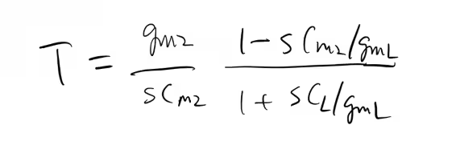

Tn的计算需要稍微列一点式子，但也非常好计算：

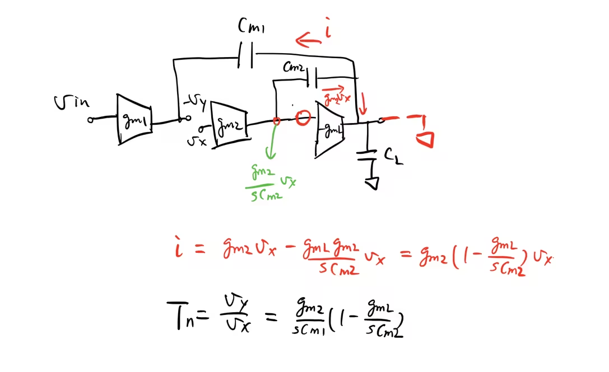

代入求得传递函数，通分化简一下就是论文里这个形式

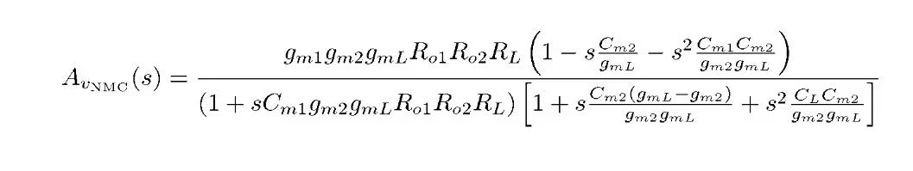

可以看到，由于T中含有第二层局部反馈带来的右零点，一次项系数中会含有gmL-gm2，减gm2就是局部反馈的零点导致的，会提高H的次级点或者说T的GBW而引起不稳定（其实也就是第一层局部反馈的相位裕度减小）。

假设极点分离，且gmL远大于gm2，可以得到GBW和两个极点分别为

gm1/Cm1、gm2/Cm2、gmL/CL

这三个点怎么放有不同的说法，这篇文章里说用二分之一四分之一的关系，造复极点出来（巴特沃斯滤波器的形式）。Ivanov则说用三分之一九分之一，更稳定。

由于分母上假定了gmL远大于gm2，这里的Cm1和Cm2就很小，分子上Cm2带来的右零点就不明显，给相位裕度带来的影响可以忽略。

# **NMCNR(NMC with Nulling Resistor)**

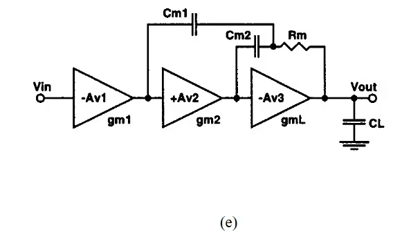

同样为了补这个右零点，NMCNR在Cm2旁边加了一个调零电阻Rm。表达式非常复杂，不去细推了，但是大概还是差不多的原理。分母依旧存在gmL-gm2，这是因为T的输出位置变了，Rm并不能补掉T的零点。

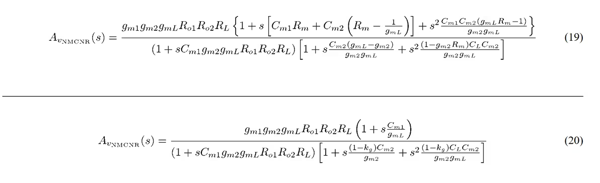

至于为什么不把Cm1的右端连到Rm的右端，这个就不太清楚了。。。这个调零电阻应该还有别的补法，可能还有些细微的tradeoff，而作者他觉得这个效果好。

补掉这个零点最大的好处就是省面积，因为要达到相同的相位裕度的话，极点就可以靠gmL/CL近一点，Cm可以略小一些。文章里举例：若NMC的Cm1是99pF，那么NMCNR只需要63pF就可以了，它将模块的面积从0.23mm^2减小到0.18mm^2。

# **MNMC(Multipath NMC)**

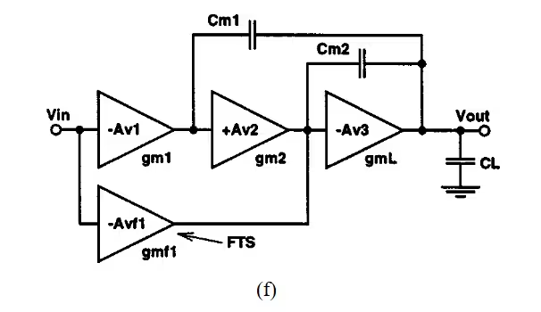

NMC的一个毛病就是：GBW、次级点和第三极点的间隔是必须的，有人就想了这么个办法，说能不能搞个零点把次级点抵消掉，这样GBW就可以离第三极点gmL/CL更近了嘛。或者换一个说法，1//T降下去的时候，1//Tn也同步降下去，这样虽然T在0dB以下，依然可以维持住理想传递函数（积分器形式）的成立。

可以看到，这里仅仅是多加了一路gmf1，对于极点没有影响（零输入，gmf1就不起作用了）。但是，gmf1改变了零点。像论文中这么理想的表达式，仅建立在gmL返回比很大的基础之上——计算gm2的零输出返回比时，gmL的栅极虚地，则Cm2上没有电流，gmf1出来的电流全部跟gm2的抵消，得到Vin，再乘以gm1和1/sCm1就得到了返回的电压。

重新仔细计算一下Tn，实际上这里的表达式应该为（记α=gmf1/gm1）

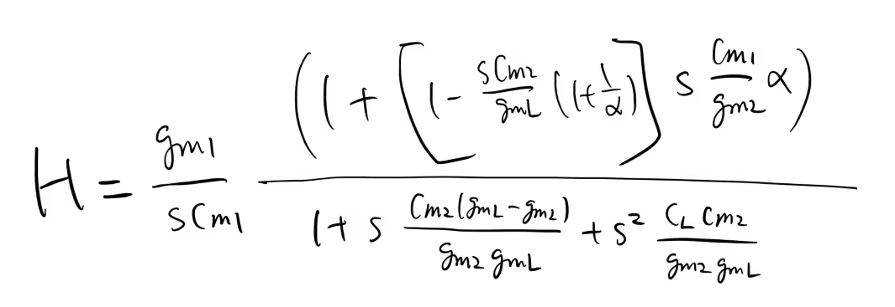

上面这个不理想的项跟gmL有关，因为要补的这个极点位置在gm2/Cm2处，那么就需要gmL/Cm2远大于gm2/Cm2，也就是gmL&gt;&gt;gm2。

文献中给的一种设置方法是gm2/Cm2=0.1gmL/CL，这么设是为了使第三极点更远。从局部反馈很好理解：将T的GBW放低会降低闭环的Q值，也就是提升了第三个极点，但是GBW太低，提升也有限，反而极零对的影响更大了。注意到这里Cm2就比之前的设置方法要大（但是Cm1会比之前小），并且会降低摆率。为提升摆率，可以采用加射极电阻的方法。

# **NGCC(Nested Gm-C Compensation)**

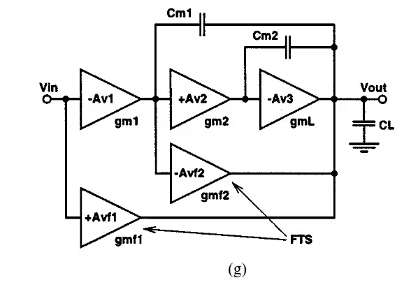

其实就是MZC的推广：跟所有的Tn说拜拜。

若gmf1=gm1，gmf2=gm2，则这里的Tn=0，T.Tn=0。所以，H没有零点，T也没有零点，也就是说分母上没有gmL和gm2相减。传递函数就非常简单了，具体为：

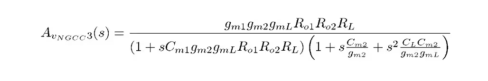

如此一来分母就变得稳定多了，不再需要gmL&gt;&gt;gm2的假设，对于低功耗设计是好事（论文作者在SMC中阐释了gm1&lt;&lt;gmL的坏处）。

# **NMCF(NMC with Feedforward Gm Stage)**

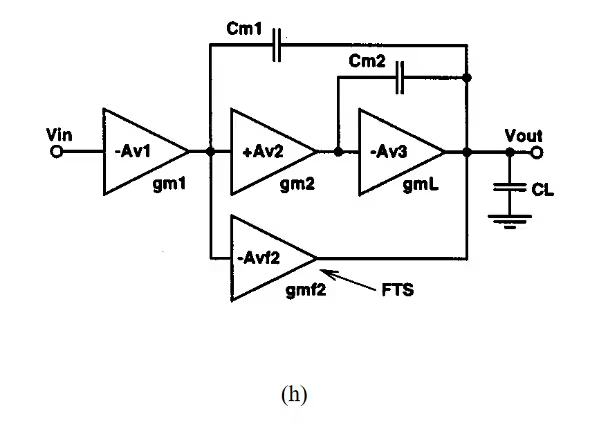

NMCF就是NGCC的一个变化，去掉了gmf1，且使gmf2更大，以生成左零点。

NMCF的T等于MZC的H：

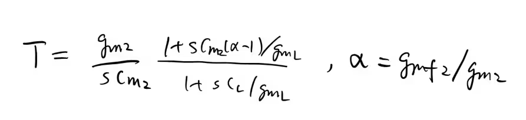

Tn也很容易得到

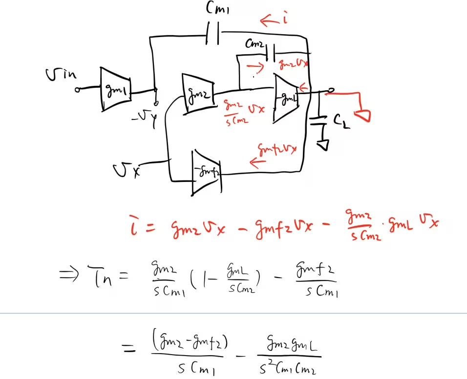

通分化简得到H

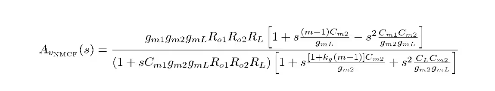

这里kg=gm2/gmL，m=gmf2/gm2，显然m大于1，kg小于1

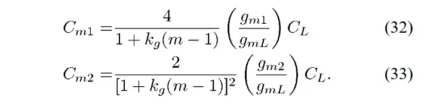

很明显Cm1和Cm2都要比NMC中的更小

# **DFCFC(Damping-Factor-Control Frequency-Compensation)**

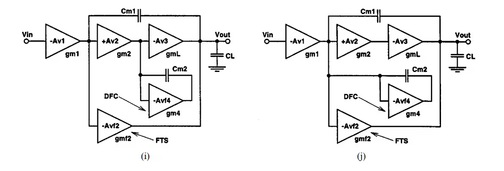

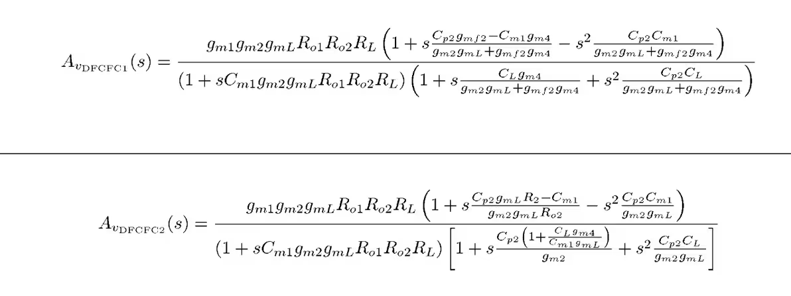

所谓的“Damping factor”，指的是分母二次多项式的阻尼系数，控制这个东西也就是控制局部反馈的环路增益T的GBW和次级点的关系。DFCFC是针对大电容负载下，gmL很难用ID进一步提升的情况。之前的NMC类补偿，我们知道T的GBW不可能超过gmL/CL，不然就不稳定了。于是这里的问题就变成了——如何在gmL有限的情况下，采用别的方法，尽可能提高局部反馈的GBW。

这里采用了一个DFC器件，特点是低频开路，高频低阻像二极管，因为我们只考虑高频情况下的补偿技术，所以就认为它是个二极管就好了：

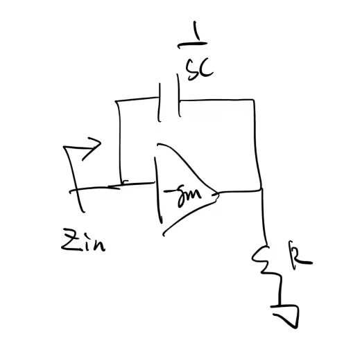

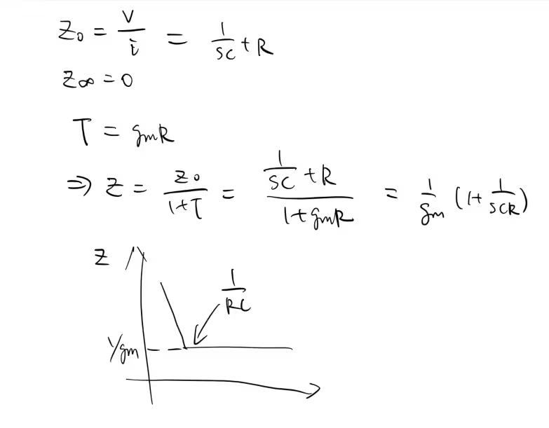

利用这个高频下的二极管，这里给出了两种增大环路增益带宽的方法，两种方法由于都是间接提高带宽，而不是直接提高gmL，所以还得另外提升最后一级的压摆率，加了一个前向通路（此前向通路不是为了补偿零点）。

# **DFCFC1(增益控制)**

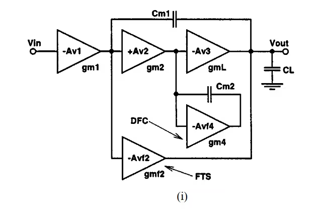

第一种方法，将二极管电阻接在局部反馈的第一级放大器（gm2）后面，降低第一级的增益，同时展宽第一级的带宽。此时电路的行为就像SMC了，SMC中的gmL变成了这里的gm2/gm4*gmL+gmf2，因为有增益gm2/gm4，这里的带宽就比原来的gmL大一点。限制带宽的因素变为了决定T次级点的gm4和Cp2（gm2输出节点的总电容）。

T=(gm2/gm4*gmL+gmf2)/sCL/(1+sCp2/gm4)

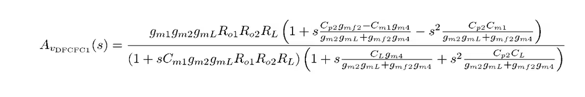

如果先不看gmf2，在局部反馈T中，GBW随着gm4增大而减小（gm2这一级的增益与gm4成反比），而局部反馈的次级点gm4/Cp2随gm4的增大而增大。gm4为0的时候，闭环1//T是两个复极点；gm4很大的时候，1//T是两个实极点。

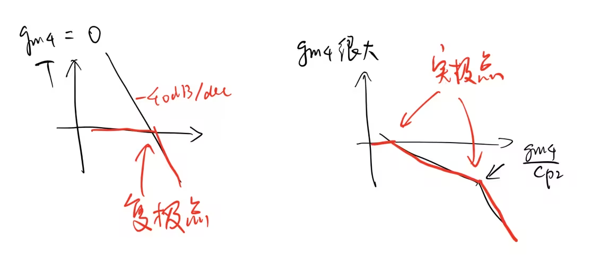

于是可以画出下面的根轨图（箭头表示gm4增大过程中的闭环根轨）：

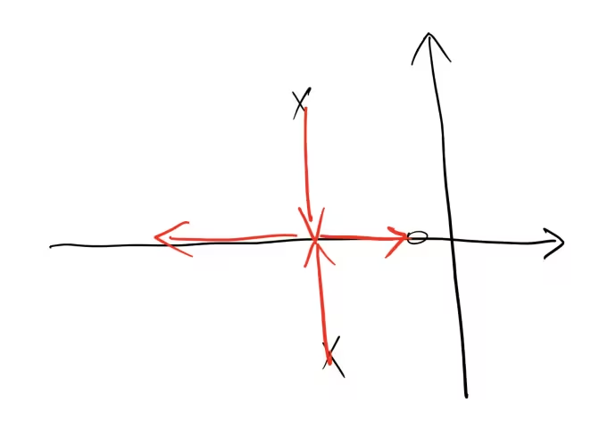

所以gm4从0到无穷大的过程中，会使极点分离。加入gmf2后，趋势也是差不多的，这里作者设gmf2=gmL。按巴特沃斯滤波器的传递函数，可以算出gm4的合理值，这也是文章里说的优化方法。

具体解这个方程就可以了：

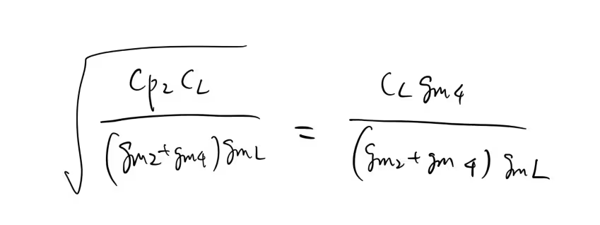

得到gm4的值为

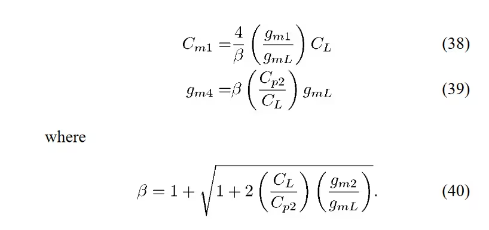

还是按三阶巴特沃斯滤波器的形式，最后得GBW为

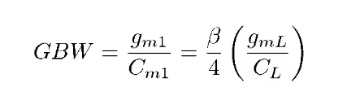

很明显看到，GBW已经超过了gmL/CL的限制。

# **DFCFC2（一阶高通滤波）**

第二种方法，采用高通滤波，将DFC这个二极管电阻和Cm1串在一起，使T的环路多出一个一阶高通的环节。本来两级级联的下降速率是-40dB/dec，加了个高通之后，前半部分就是-20dB/dec，只要滤波的拐点在T的GBW外，那就能保证稳定。

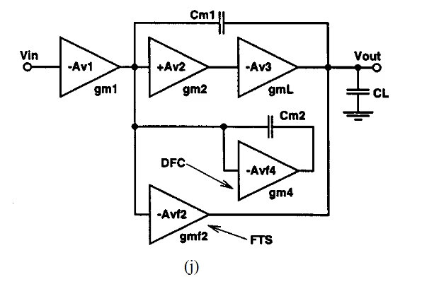

还是忽略gmf2来计算环路增益

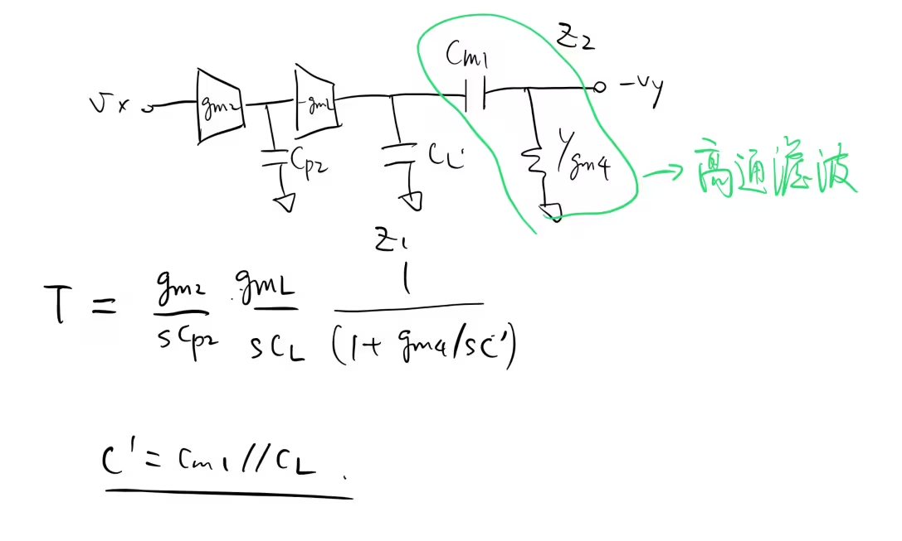

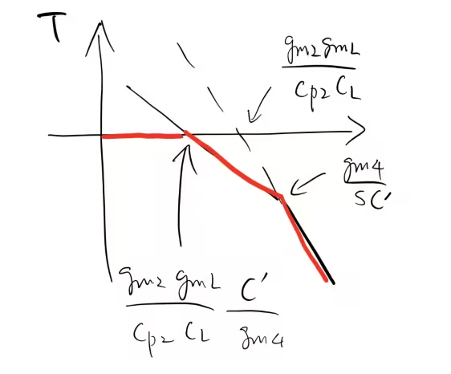

可以明显看到，这个高通滤波的拐点越往后，极点分离现象越明显。

考虑gmf2进去，得到表达式：

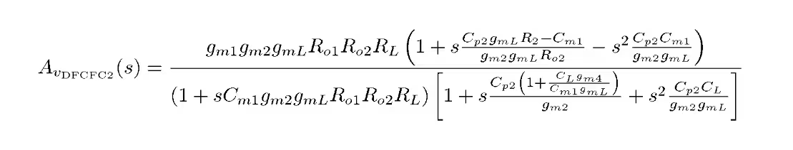

使gmf2=gmL，以同样的方法解得合适的gm4、Cm1、gm1：

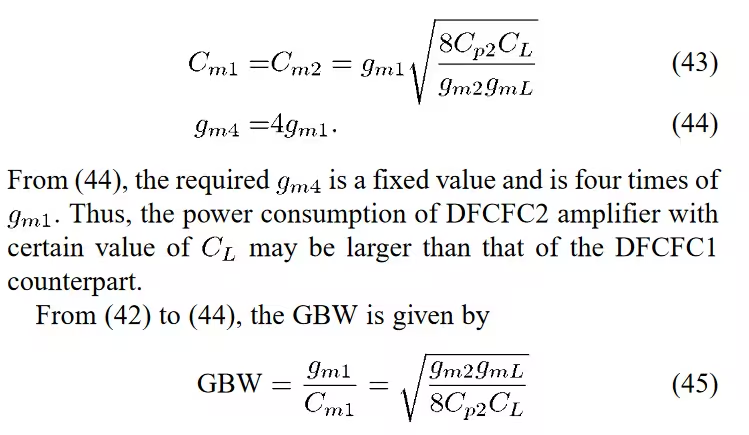

最终GBW的表达式也可以写出来。

# **总结**

# **各补偿方法的参数取值：**

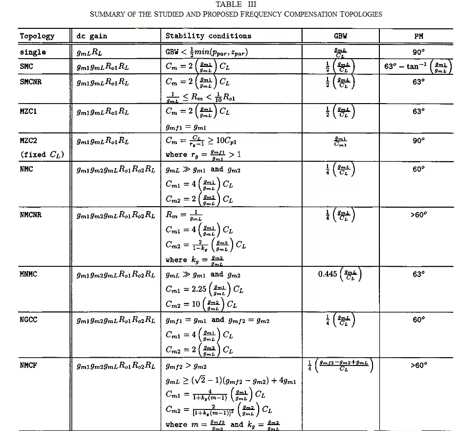

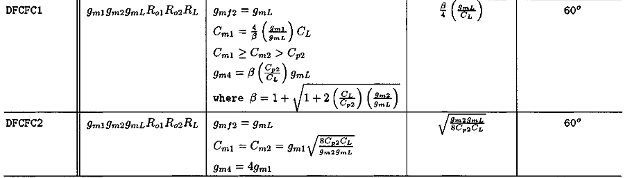

**各三级运放补偿方法相对于NMC的优劣**

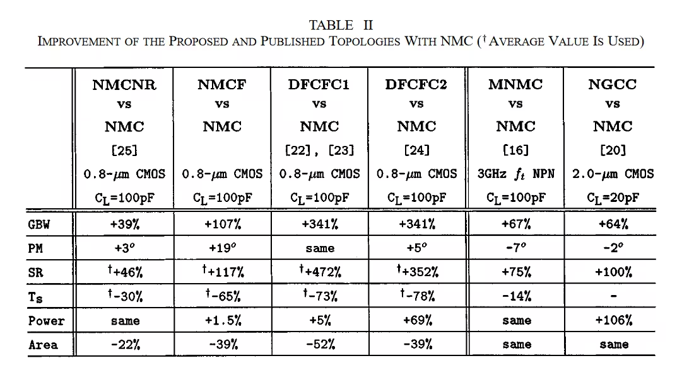

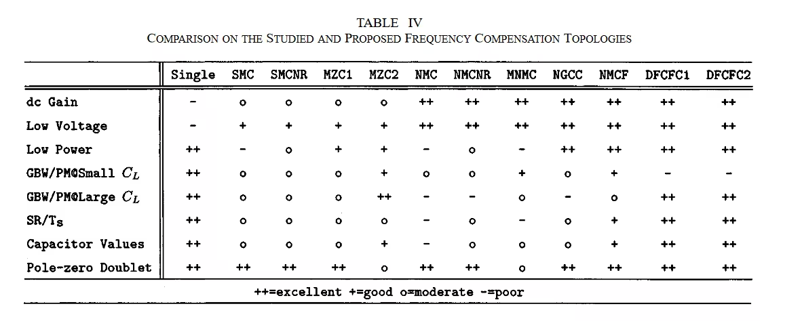