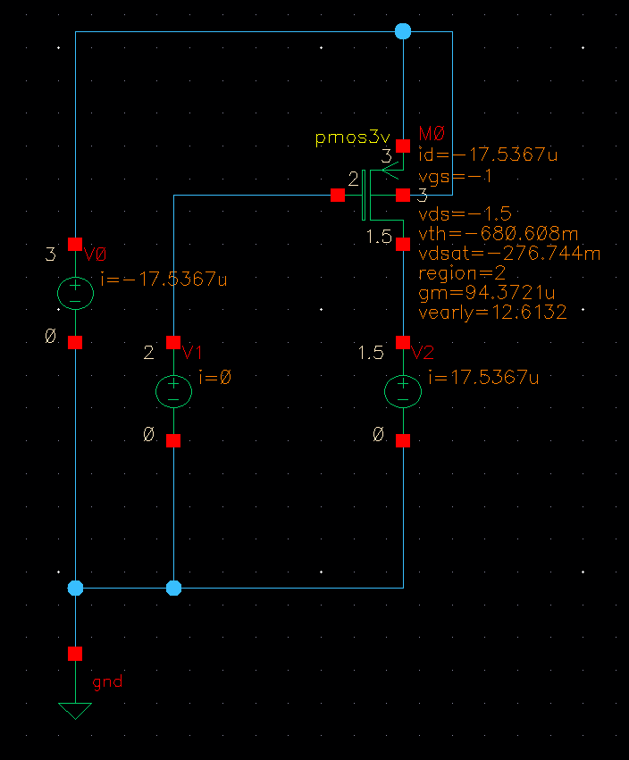

# LDO 学习笔记
   
## Tutorial Roadmap(学习路线)

   - [ ] Performance metrics(性能指标)
   - [ ] Stability(稳定性)
   - [ ] Power supply rejection(电源抑制)
   - [ ] Summary
### Performance metrics
   - Dropout Voltage 
   - Quiescent Current
   - Efficiency
   - Line Regulation
   - Load Regulation
   - Line Transient Response
   - Load Transcient Response
   - Power Supply Rejection
   - Accuracy

我的设计指标：（Vin范围最大为3V）

## 第一步pass管的设计
### 1.1核心约束

先对PMOS

| 约束       | 数值    | 含义            |
| -------- | ----- | ------------- |
| Vin_min  | 2.0V  | dropout是的最低输入 |
| Vout     | 1.8V  | 输出标称          |
| Iout_max | 10mA  | 满载电流          |
| VDO_max  | 200mV | dropout压降上限   |
