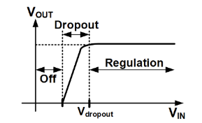

# LDO 学习笔记
   
## Tutorial Roadmap(学习路线)

   - [ ] Performance metrics(性能指标)
   - [ ] Stability(稳定性)
   - [ ] Power supply rejection(电源抑制)
   - [ ] Summary
### Performance metrics
   - Dropout Voltage 
   - Quiescent Current
   - Efficiency
   - Line Regulation
   - Load Regulation
   - Line Transient Response
   - Load Transcient Response
   - Power Supply Rejection
   - Accuracy

我的设计指标：

1.Dropout Voltage 

Vin上升到Vout不再变化时，此时Vin-Vout就是Vdropout 电压