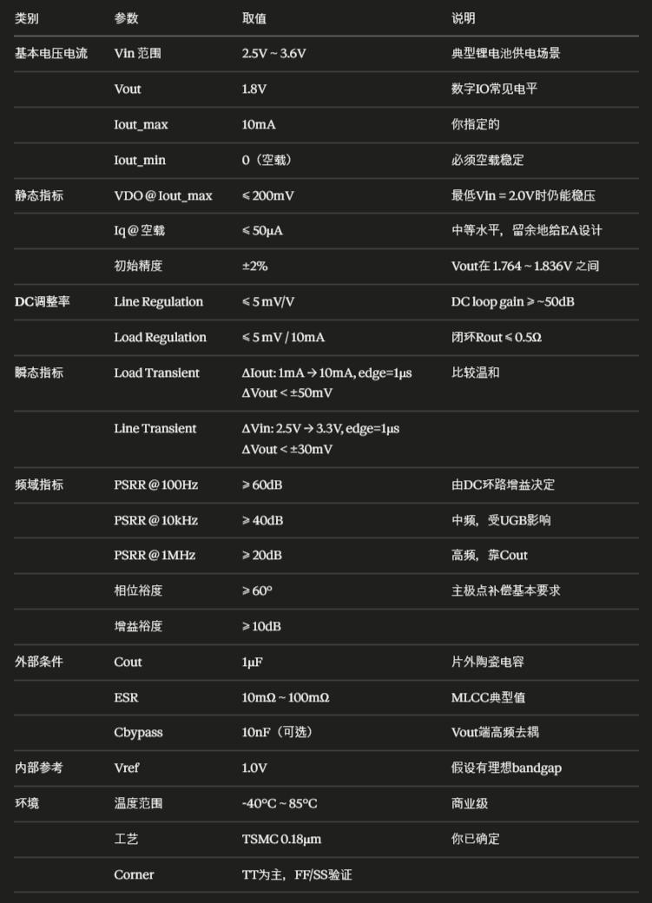
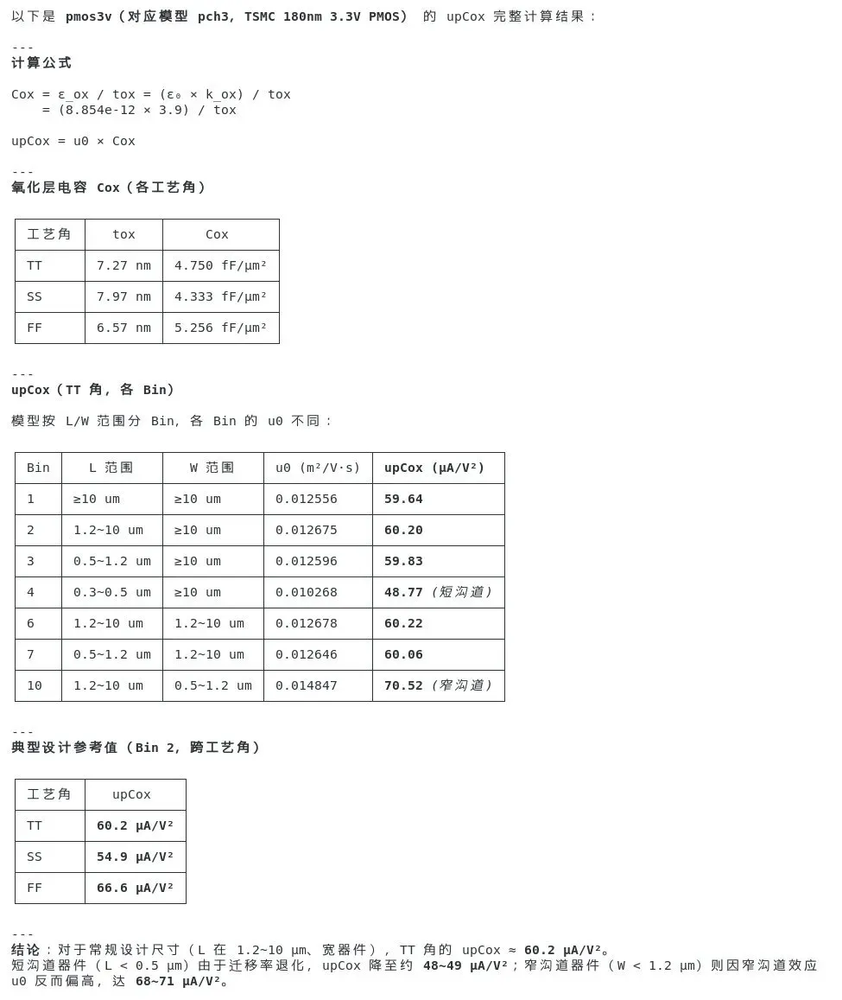
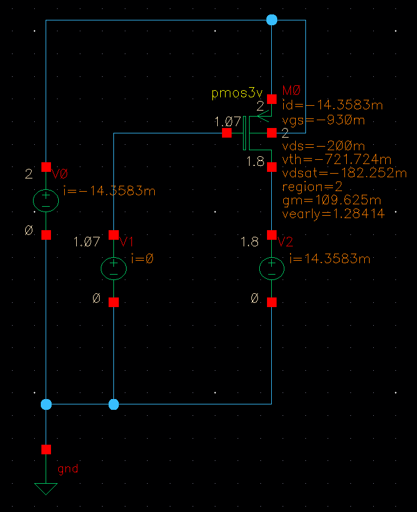
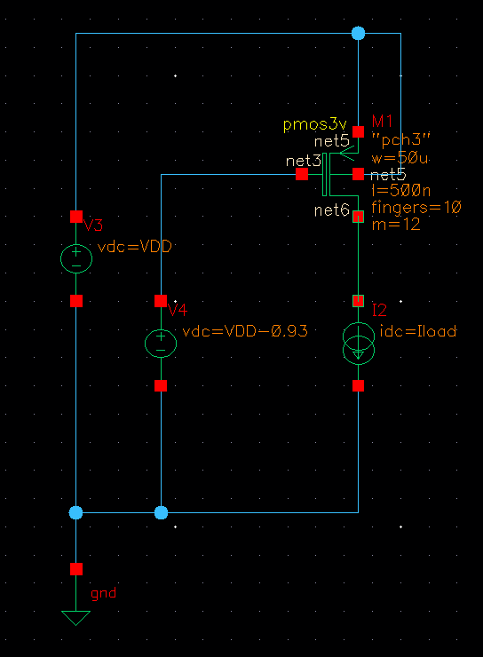
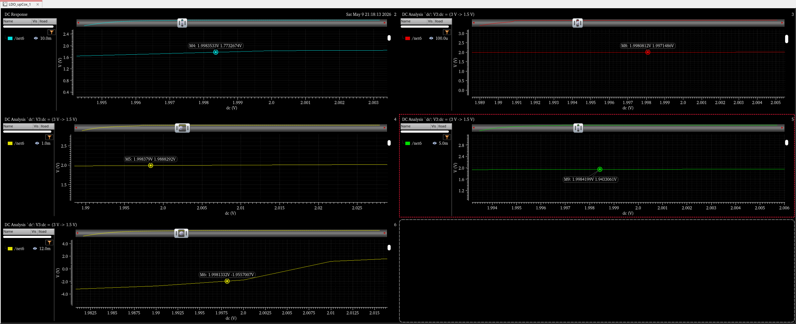
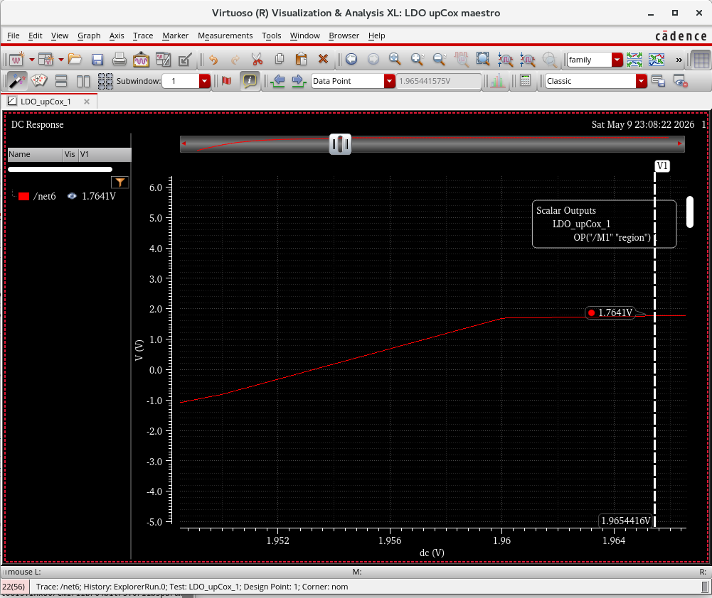
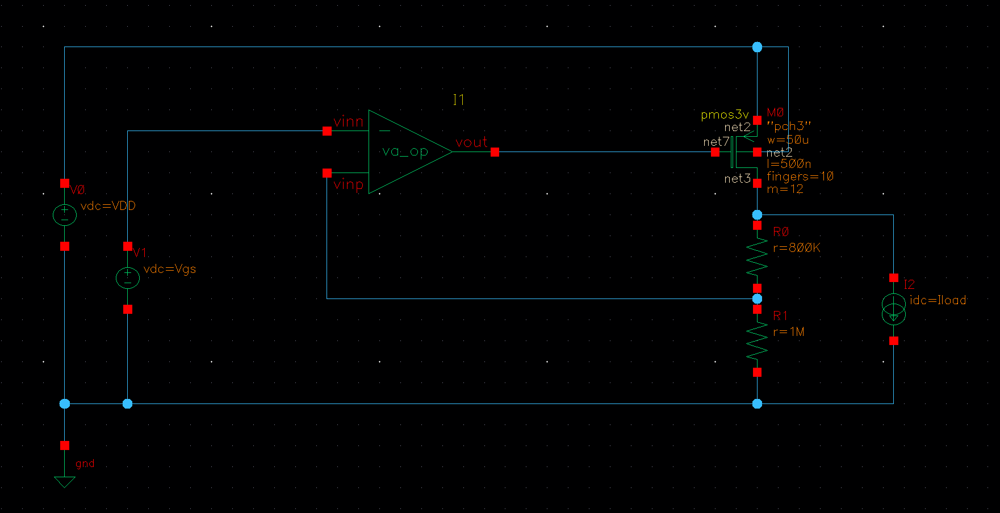
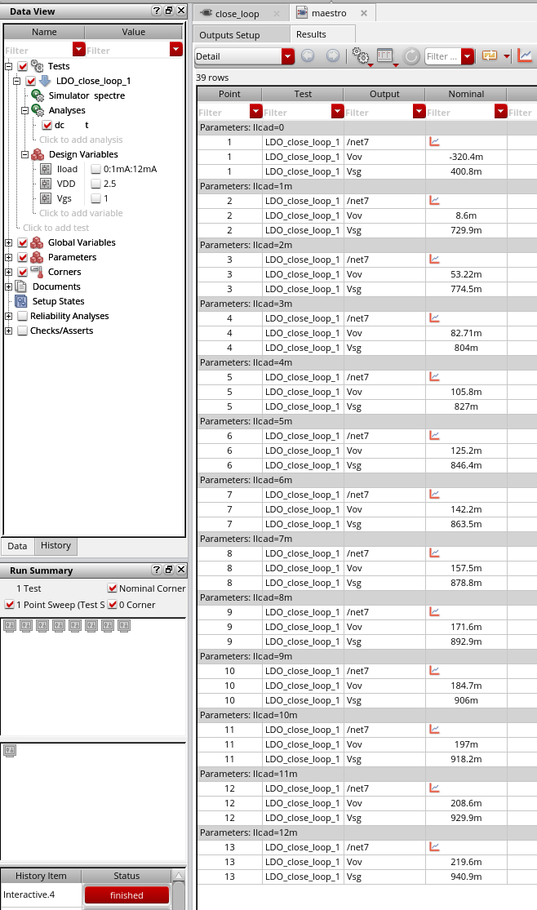

# LDO 学习笔记
   
## Tutorial Roadmap(学习路线)

   - [ ] Performance metrics(性能指标)
   - [ ] Stability(稳定性)
   - [ ] Power supply rejection(电源抑制)
   - [ ] Summary
### Performance metrics
   - Dropout Voltage 
   - Quiescent Current
   - Efficiency
   - Line Regulation
   - Load Regulation
   - Line Transient Response
   - Load Transcient Response
   - Power Supply Rejection
   - Accuracy

我的设计指标：（Vin范围最大为3V）

claude code 算出的μpCox的值

## 第一步pass管的设计
### 1.1核心约束

输出电压为1.8V，那么在Vds=200mV的时候，VDD=2V，给出管子的L为2倍的最小值，然后将管子的Vov固定为200mV，这样管子一定工作在饱和区，然后通过调整管子的W值将电流调整为最大需要的负载电流。

| 数值    | 约束       | 含义            |
| ----- | -------- | ------------- |
| 2.0V  | Vin_min  | dropout是的最低输入 |
| 1.8V  | Vout     | 输出标称          |
| 10mA  | Iout_max | 满载电流          |
| 200mV | VDO_max  | dropout压降上限   |

仿真结果：

$$
\begin{gather}

VDD = 2V，V_{g} = 1.07V，V_{d} = 1.8V，μ_{p}\cdot C_{ox} = 60μA/V^{2} \\
V_{sg} = VDD - V_{g} = 2-1.07 = 0.93V \\
V_{ov} = V_{sg}-|V_{th}| ≈ 210mV \\
I_{d} = \frac{1}{2}×μ_{p}\cdot C_{ox}\frac{W}{L}\cdot V_{ov}^{2} = 0.5 × 60μ × 16800 × （0.21)^{2} ≈ 14.8mA
\end{gather}
$$

这个计算的结果和仿真的接近。最终去==W/L= 120×50u/0.5u==，电流大小为10.2559mA。

### 1.2测试
#### 测试1：VDO-Iload全扫描
仿真设置“

$$
\begin{gather}
DC\ sweep :V_{in}→from\ 3V\ to\ 1.5V \\
Parametric\ sweep:\ Iload = 0.1mA,\ 1mA,\ 5mA,\ 10mA,\ 12mA \\
可以将V_{g}设置为：\ V_{g} = V_{in} - 0.93V,\ 即跟随V_{in}保持恒定
\end{gather}
$$

仿真电路：

仿真结果：

仿真结果：Vin=2V

| Iload | Vd     | Vsd=Vin-Vd | PMOS区域   |
| ----- | ------ | ---------- | -------- |
| 100u  | 1.997V | 3mV        | 深triode  |
| 1mA   | 1.989V | 11mV       | 深triode  |
| 5mA   | 1.943V | 57mV       | triode   |
| 10mA  | 1766V  | 234mV      | 饱和边界     |
| 12mA  | -1.96V | -          | PMOS无法供电 |

结论：
（1）在固定Vgs的情况下，12mA的时候曲线塌到-1.96V，这说明PMOS的**饱和电流上限大约在10~11mA之间**。一旦Iload超过这个值，电流sink要不到电流，节点电压被sink拉到compliance极限。
（2）在 Iload=10mA 时 Vsd=234mV，比目标的200mV偏大，这是由于沟道长度调制效应的影响，反推：

$$
I_{d} = \frac{1}{2}×μ_{p}\cdot C_{ox}\frac{W}{L}\cdot V_{ov}^{2}(1+λV_{sd})
$$
10mA带入：
$$
I_{d,sat}\cdot (1+λ\cdot 0.234) = 10mA 
$$
由仿真可知 λ ≈ 0.7787/V，那么 (1 + 0.7787×0.234) = 1.182，所以 Id_sat0 = 10/1.182 ≈ 8.46mA。
说明这里的Vgs提供不了这么大的电流，故需要增大管子的宽长比。
**增加宽长比再次仿真：得到Vds=201mV，故在输出电流为10mA，输出为1.8V是最低的输入电压为1.8V+0.201V=2.001V，满足最低的2V要求。**

==要在所有工艺角下都满足要求。==

这里的**Vsd = 234mV**叫做=="saturation headroom"（饱和余量）==PMOS要保持在饱和区所需的Vsd下限。
这个数字也很重要：
- 在saturation里，pass管的小信号参数（gm, rds）行为良好，环路特性可控。
- 一旦进入triode，gm会随Vds变化，rds急剧下降（变成Ron），整个环路动态特性会改变。
- LDO设计中通常希望正常调节状态下PMOS在饱和区，dropout只是边界条件。
所以这个234mV告诉你：只要 Vin > 2.034V，pass管就稳稳在饱和区。这是一个对环路设计有意义的spec。

#### 测试2

闭环测试，理想运放：增益100K，VDD= 2.5V，Iload=0:1mA：12mA

仿真结果：从仿真图中看出，负载为10mA时Vov为197mV，功率管在饱和区，满足设计要求。

### 1.3小信号参数提取
测试电路：

测试条件：VDD去一个中间的点2.5V，其他如图。Iload= 10uA 1mA 10mA

***PASS管的参数：***

| Iload |   Vgs   |   Vov   |   gm   |  gds   |  rds   |   Cgs   |   Cgd   |
| :---: | :-----: | :-----: | :----: | :----: | :----: | :-----: | :-----: |
| 10uA  | -503.3m | -217.9m | 248.1u | 670.5n | 1.491M | -2.002p | -1.928p |
|  1mA  | -729.9m |  8.6m   | 16.56m | 57.33u | 17.44k | -5.963p | -1.955p |
| 10mA  | -918.2m |  197m   | 83.82m | 568.6u | 1.759k | -9.737p | -1.965p |
#### ==三个问题：==
##### 1.轻载是PMOS在亚阈值区
Vov = -218 mV（负值）说明Vsg < |Vtp|，PMOS此时**没有强反型沟道**，靠扩散电流工作。
体现在数据里：
- gm 比满载小 **338倍**（248μA/V vs 83.8mA/V）
- rds 比满载大 **850倍**（1.49MΩ vs 1.76kΩ）

这**不是异常**，是LDO的**固有特性**——空载时pass管必然在亚阈值。
这意味着：
LDO的环路特性在不同负载下完全不同。后面做稳定性时，必须至少在 10μA、1mA、10mA 三个点都验证相位裕度，不能只看一个工作点。

##### 2.本征增益的变化

| Iload | gm*rds   |
| ----- | -------- |
| 10uA  | 370≈51dB |
| 1 mA  | 288≈49dB |
| 10mA  | 148≈51dB |
满载的时候本征增益反而最低，rds下降的比gm快。

含义：
- **Load Regulation的最差工作点在满载**（rds最小，环路抑制最弱）
- 后面验证 load reg 重点看 Iload=10mA 这条数据

##### 3.EA的输出摆幅要求
|Vgs|从503mV变化到918mV，变化了415mV
这意味着：EA的输出电压范围

| 工况                         | Vg需求                             |
| -------------------------- | -------------------------------- |
| VDD=3V，Iload=10uA          | Vg≈2.5V                          |
| VDD=2.5V，Iload=10uA        | Vg≈1.5V                          |
| VDD=2.5V，Iload=10mA        | Vg≈1.58V                         |
| VDD=2V，Iload=10mA（dropout） | Vg≈1.08V（PMOS可能进入triode，需要更低的Vg） |

故Vg 的摆幅在1.0V到2.5V。
这里求λ：和之前仿真的有区别[pass管子扫描](assets/pass管子扫描.png)

$$
λ = \frac{g_{ds}}{I_{d}} = \frac{568.6μ}{10mA}≈0.057/V
$$

