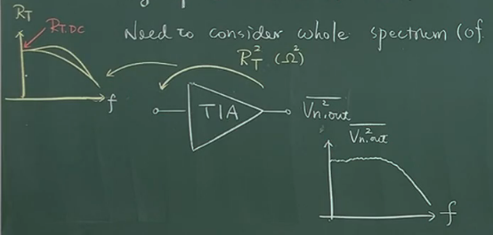
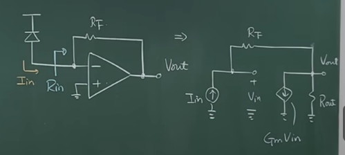

## lecture1

→ A device efficiently converting current to voltage
→The very front-end in the RX of optical serial links(接收信号的最前端，光串联链路)
→ Provide reasonable gain（增益不会太大）introducing minimal noise and briding signal to the subsequent blocks.(引入最小的噪声，桥接信号和后面的模块)

Optical RX

光电二极管→TIA→(可能用到单端转双端，或者后面再做单端转双端)→再做CTLE+LA、或者equallazer(均衡器)这些

TIA：不能饱和(需要调控TIA的gain)，需要gain contral 越自动越好(最好是自己可以判断调整gain，在模拟世界解决)

阻抗要求：大多数情况是没什么阻抗的要求的，但是还是输入阻抗越小越好(保证感应的电流大多数都进入TIA)

介绍PD：Photo diode

另一个名称：P-intrinsic-N(PIN)
特点：  
	1. 反偏
	2.光照进二极管耗尽区时产生电流

光照产生反向的反流，如右图，不同光照强度产生不同的电流。

判断PD的好坏参数：Responsivity如下图：

Responsivity(R)响应度：会和偏压有关系
定义如下:（其中Input light Power 是光的功率可以量的出来）

$$
R \triangleq \frac{Induced \, I}{ Input \, light \, Power} (A/W)
$$

举例：
	1. R = 0.5 (A/W)    for    850nm lacer(激光)
	2. R = 0.9 (A/W)    for    1.55μm lacer

ER (Extinction Ratio)(消光比)：逻辑1时候的power和逻辑0时候的power（关断和开启）

$$
ER \triangleq \frac{P_{1}}{P_{0}} = \frac{Logical \, 1 \, Power}{Logical \, 0 \, Power} \, (A/W)
$$

## lecture2

Input-REF Noise

High-speed (broadband) devices →
Need to consider whole spectrum(of interest)

输出等效噪声除增益 $R_{T}^2$   ；在带宽内积分，积分的结果才是所有的Noise

增益 $R_{T}^2$  也可能是和频率相关的。直接用  $R_{T,DC}$  来除就好了
输入噪声定义：

$$
\overline{I_{n,in}^2} \triangleq \frac{\int_{0}^{\infty} \overline{V_{n,out}^2} \,dx}{R_{T,DC}^2}
$$

RMS Noise current：

$$
I_{n,rms} = \sqrt{\overline{I_{n,in}^2}}
$$

==TIA must contribute as little noise as possible to ensure sensitivity== ：贡献尽可能少的噪声确保灵敏度，如下图：噪声大了信号就被淹没了，检测不到了

Photo diode Noise(shot noise)：这个是器件的选型相关的

$$
\overline{I_{n}^2} \triangleq 2  \cdot q \cdot I
$$

举例：Ex Consider an optical front-end , determine: 如下图
(a) Overall gain(总增益需要多少)   (b) max(最大的噪声多少可以接受)

平均光的功率 $\overline{P}$ 、消光比 $ER$、 响应度 $R$ 

$$
\begin{cases}
\overline{P} = -12 \text{dBm} \\
ER = 6 \text{dB}  \\
R = 0.9 \text{A/W} \\
D_{out} \geq 600 \text{mV}_{pp}
\end{cases}
$$

tolerable input-referred noise for $BER < 10^{-12}$  

==(a) Overall gain(总增益需要多少)：==

$$
\begin{gather}
ER = 6 dB = 10 \log_{10}\frac{P_{1}}{P_{0}}   \\
P_{1} = 4 P_{0}
\end{gather}
$$

平均功率:

$$
\begin{gather}
\frac{1}{2} (P_{1} + P_{0}) = -12 \text{dBm} = 63 \mu \text{W}  \\
P_{1} = 100.8 \mu \text{W} , P_{0} = 25.2 \mu \text{W}
\end{gather}
$$

又  $R = 0.9 A/W$  得到：

$$
\begin{gather}
I_{1} = R \times P_{1} = 90.7 \mu \text{A} \\
I_{2} = R \times P_{2} = 22.7 \mu \text{A}  \\
I_{pp} = I_{1} - I_{2} = 68 \mu \text{A}
\end{gather}
$$

所以，从输入到 $D_{out}$  需要的增益：

$$
Total \, gain = \frac{600 \text{mV}}{68 \mu \text{A}} = 8.8 \text{k} \Omega = 79\text{dB} \Omega 
$$

For example, wo choose $TIA \,gain = 46 \text{dB} \Omega$   $LA \, gain = 40 \text{dB}$  留有余量。

==(b) max(最大的噪声多少可以接受)：==  SNR越大越好，但是要达到什么程度可以达到我们的要求呢？ $BER < 10^{-12}$  
需要 $V_{pp} / noise_{value} \geq 14$     ==注：在宽频放大器那里有讲==

首先有：

$$
\begin{cases}
\frac{I_{pp}}{I_{n,RMS}} \geq 14  \\
I_{pp} = 68 \mu \text{A}  \\
I_{n,rms} = \sqrt{\overline{I_{n,in}^2}}
\end{cases}
$$

得到：

$$
I_{n,RMS} \leq 4.8 \mu \text{A,rms}
$$
这个值是， Photo diode + TIA noise + LA noise 总噪声等效到TIA输入的值小于 $4.8 \mu \text{Arms}$ 

==Caculate PD noise in a 10GHz system:==
PD 噪声：

$$
\begin{gather}
\overline{I_{n,\text{PD1}}^2} = \int_{0}^{\infty} \overline{I_{n}^2} \,df = 2 \cdot q \cdot I_{1} \cdot BW  \\
q = 1.6 \times 10^{-19} \text{K} \\
I_{1} = 90.7 \mu \text{A}
\end{gather}
$$

$$
\begin{gather}
\overline{I_{n,\text{PD0}}^2} = \int_{0}^{\infty} \overline{I_{n}^2} \,df = 2 \cdot q \cdot I_{0} \cdot BW  \\
I_{0} = 22.7 \mu \text{A}
\end{gather}
$$

解得：

$$
\begin{gather}
I_{n,PD1,rms} = 0.54 \mu \text{A,rms} \\
I_{n,PD0,rms} = 0.27 \mu \text{A,rms}
\end{gather}
$$

*Why a TIA? Why not a simple resistor?
1. Lower Input-resistance

如上图：当频率高的时候会产生电容的分流，以及 $R_{T}$  的分流。导致到达下一级的信号变得很微弱。
$R_{in} \ll R_{T}$  ，保证所有的电流都流过TIA。

An active TIA with proper design provide much lower input resistance → guaranteeing most PD current flowing in to TIA.

2. Gain Contral
A TIAwith automatic gain contral can increase its dynamic range, preventing itself from 'saturation' and ensuring sufficient amplification.

3. Low Output-resistance

Low Output-resistance to properly drive  the subsequent blocks.

4. More bandwidth（后面讲）

5. Noise

==Feedback TIA(shunt-shunt)==

（a）Low freq：
其中  $G_{m}R_{F} \gg 1$  ;  $G_{m}R_{out} \gg 1$  

$$
\begin{gather}
I_{in} = G_{m} V_{in} + \frac{V_{out}}{R_{out}} = \frac{V_{in} - V_{out}}{R_{F}} \\
R_{T} = \frac{V_{out}}{I_{in}} = \frac{R_{out} (1 - G_{m} R_{F})}{1 + G_{m} R_{out}} \approx - R_{F}
\end{gather}
$$

