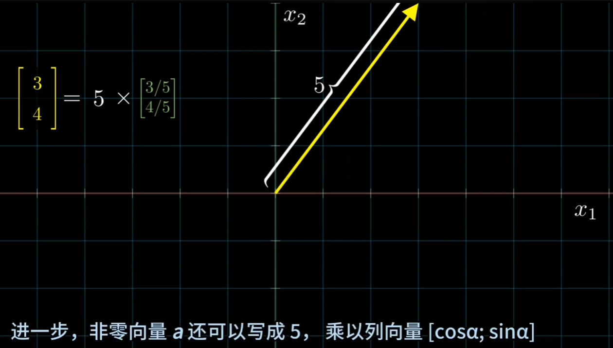

### 1. 向量单位化

如图举例：
二维列向量：$$ \vec{a} = \begin{bmatrix} 3\\4 \end{bmatrix}$$ 
它的单位向量为：$$ \vec{a} = \begin{bmatrix} \frac{3}{5}\\\frac{4}{5} \end{bmatrix} $$

有了方向向量，平面上的非零向量a就可以表示为：长度×方向
$$\vec{a} = \Vert a \Vert \cdot \hat{a} $$
所以上面的二维向量可以表示为：如下图
$$ \begin{bmatrix} 3\\4 \end{bmatrix} = 5 \times  \begin{bmatrix} \frac{3}{5}\\\frac{4}{5} \end{bmatrix}$$

同样可以变为：$$ \begin{bmatrix} 3\\4 \end{bmatrix} = 5 \times  \begin{bmatrix} cos(\a)\\\frac{4}{5} \end{bmatrix}$$