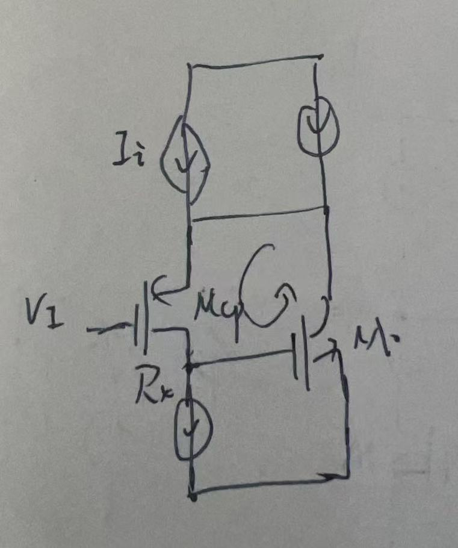
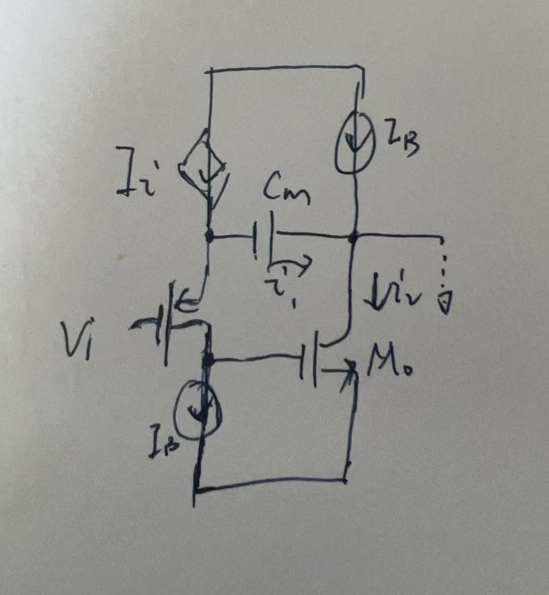
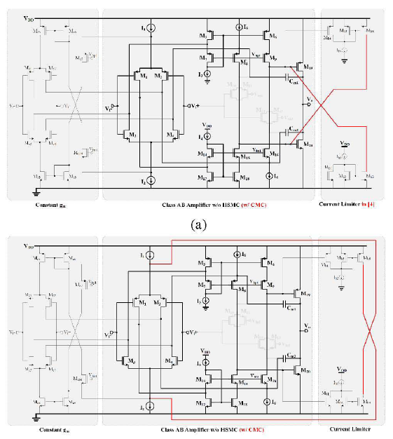
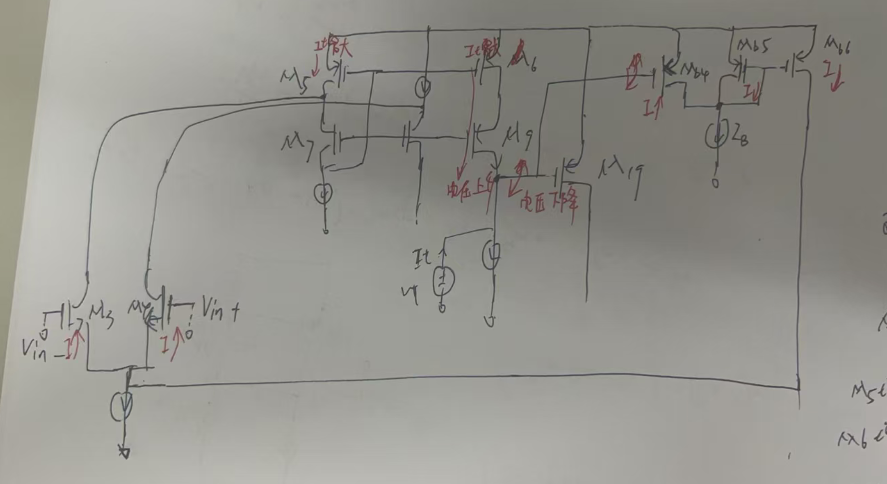

创新点：提出了高压摆率密勒补偿技术和输出电流限制。

| 功耗  | 18uA   |
| --- | ------ |
| 摆率  | 30V/μs |

平均压摆率：FOM_L = 34.72
单位增益频率：FOM_S = 10.11

1.为了高效驱动各种容性负载,运算放大器必须采用 Class-AB 结构来实现：

2.提出的HSMC的概念

图（a）左的摆率：Rz用于消除右半平面的零点不影响摆率，主要是Ii电流在Cm电容上的积分摆率为：
图（a）右：通过Mcc消除有平面的零点；但是并不能提供给额外的电流，主要还是Ii电流在Cm上的积分：

$$
SR_{CMC} = \frac{I_{i}}{C_{m}}
$$

图（b）提出的HSMC：
Vi由高变低时，Mcp的过驱动电压很大，故产生一个远大于Ii的电流，这个电流来自Cm上，Mo的栅极突然升高，通过Mo将输出拉低，Mo的栅极电容远小于Cm，电流还是会在Mo栅电容上积分：

$$
SR_{CMC} = \frac{I_{i}+I_{M_{cp}}}{C_{mo，G}}
$$

高频下的驱动能力：
Vi跳低的时候，Cm电容可以视为短路，Mcp产生一个大的过驱动电压，所以会产生一个大的电流，这个电流是不受别的电流限制的，且直接作用在负载上。

高频的时候Cm相当于短路：

高频线小信号的输出电阻被负反馈降低了：
$$
R_{out} = \frac{1}{g_{mcp}+g_{m,cp}\cdot R_{x}\cdot g_{m,o}}
$$

Class AB类的输出极点都不是主极点，那么相比于普通的Class AB输出，这个在高频的时候输出极点的频率会更高，补偿起来应该更容易。

零点的变化：

Cm电流等于Mo的电流：
$$
\begin{gather}
V_{i}\cdot SC_{m} = V_{i}\cdot g_{m,cp}\cdot R_{x}\cdot g_{mo} \\
S = \frac{g_{m,cp}\cdot R_{x}\cdot g_{mo}}{C_{m}}
\end{gather}
$$
$$
可知零点的频率也是较普通的Class AB提高了很多。这里有个问题就是，如果I_{i}= g_{m}V_{i}
$$
那么在计算的过程中是没有零点的。

==但是现在有个问题，就是Mo的栅极的极点是否会被密勒补偿补偿掉。==(后面要看下)

$$
\begin{gather}
g_{m,cp}(V_{in}-V_{x}) = \frac{V_{x}}{r_{o2}}+SC_{m}(V_{x}-V_{o})\\
g_{m,cp}(V_{in}-V_{x})\cdot r_{o1}\cdot g_{mo} = SC_{m}(V_{x}-V_{o})-\frac{V_{o}}{r_{o3}}
\end{gather}
$$

输出级偏置的问题：通过两个电流限制器形成的负反馈控制M19和M20的栅极
文中提到图a会导致直流增益下降：我认为是由于Mb6的结构问题，是由于Mb6是一个单的ro，而在功率管的栅极是cascode的结构，阻抗远高于ro。

本文提出的：

我的理解：假设M19的栅极电压下降，那么Mb4的栅极电压也下降，Mb4 电流增加，由于Mb5和Mb4共享一个电流Ib，那么Mb4的增加量就是Mb5的减少量，同样是Mb6的减少量，这样左侧的输入差分对管的电流就会增加，且没一个管子的增加量为Mb4在增加电流的一半（可能Mb5和Mb6的比例为1:2），然后M5的电流就会增加，同样M6复制M5的电流也增加，这时M19的栅极就得到了一个充电电流，大小为Mb4的电流，从而达到平衡。M19栅极的电阻为：（应该是对的）
$$
\begin{gather}
\frac{1}{2}V_{T}\cdot g_{mb4} = I_{T}\\
\frac{V_{T}}{I_{T}} \approx \frac{2}{g_{mb4}}
\end{gather}
$$

==我认为虽然这种结构避免提了图（a），中的直流增益降低的情况。但是如如果输入对管的尾电流采用的是cascode形式的电流源，那么这个环路的引入会引入另外一个问题，就是CMRR的下降。==
所以我想是否可以将右侧的Mb5和Mb6改为cascode结构，虽然也会降低尾电流源的阻抗但是不至于那么大。